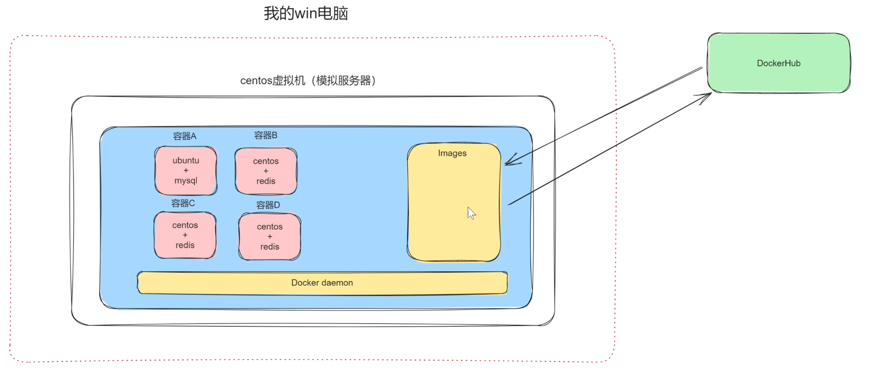
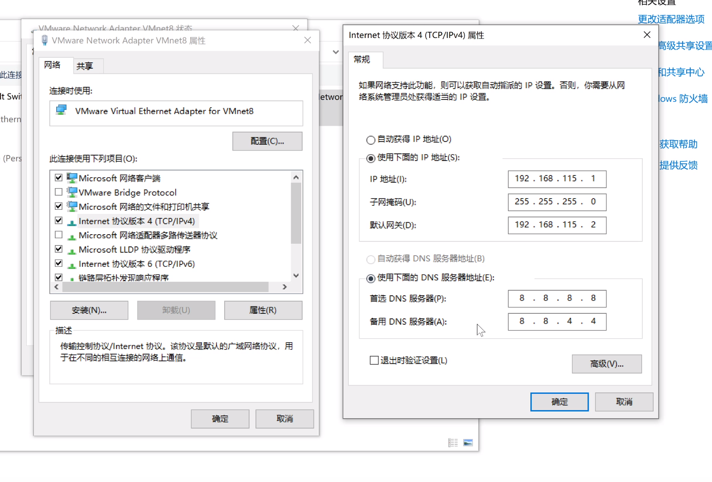
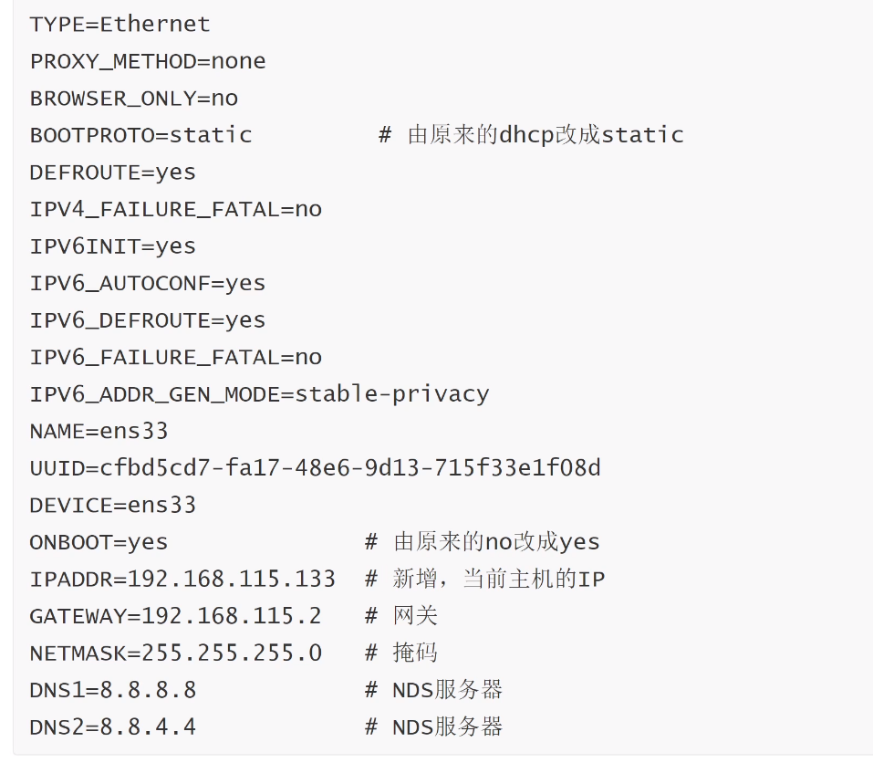

### 基础

##### 为什么要安装docker？

+ 创建多个隔离的环境
  
  其他方式：多物理机或虚拟化

+ 极大节省资源
  
  虚拟机是电脑完整地创建多个操作系统
  
  docker创建的容器不是完整的操作系统，二十充分利用宿主机和内核，创建必备资源

##### 名词解释

+ 镜像：模板，如centos+mysql，ubuntu+mysql+redis+代码等

+ 容器：隔离的环境

+ DockerHub：远程镜像仓库， https://hub.docker.com
  
  有官方和其他开发者的镜像文件

+ Images：本地镜像仓库
  
  镜像不是虚拟机创建操作系统的ISO文件



##### 环境安装

网络配置



修改 /etc/sysconfig/network-scripts/ifcfg-ens33



重启网络设置

```shell
service network restart
```

关闭selinux

```shell
getenforce # 查看状态
setenforce 0 # 临时关闭
vim /etc/selinux/config
SELINUX=disabled # 永久关闭
```

关闭防火墙

```shell
systemctl status firewalld # 查看防火墙状态
systemctl stop firewalld # 关闭防火墙
systemctl disable firewalld # 开机不启动防火墙
```

安装其他软件

```shell
yum install net-tools -y # 安装net-tools
yum install openssh-server -y # 安装openssh-server
systemctl start sshd.service # 开启openssh
systemctl enable sshd.service # 开机启动openssh
yum install wget -y # 安装wget
yum install -y epel-release
yum install -y bash-completion vim lrzsz wget expect net-tools nc
yum install -y nmap tree dos2unix htop iftop iotop unzip telnet sl psmisc
yum install -y nethogs glances bc ntpdate openldap-devel # 安装常见软件包
```

##### 安装Docker-ce社区版

```shell
yum install -y docker-ce
yum install -y docker-ce-23.0.6 # 指定版本
```

解决“没有可用软件包”

```shell
yum install -y yum-utils
yum-config-manager --add-repo 
https://mirrors.ustc.edu.cn/docker-ce/linux/centos/docker-ce.repo
yum makecache fast
yum install docker-ce
```

##### 启动docker-ce

```shell
systemctl enable docker # 开机启动
systemctl start docker # 启动
systemctl restart docker # 重启
systemctl stop docker # 关闭

docker version # 查看版本
docker info # 查看信息

docker search ubuntu
docker pull ubuntu # 拉去ubuntu
```

##### 配置加速镜像

aliyu或Daocloud

##### 宿主机端口转发

##### 部署Flask网站

1. 获取镜像（略）

2. 构建镜像
   
   + Dockerfile+语法
     
     + 在宿主机内创建两个文件：Dockerfile和app.py
     
     ```docker
       # Dockerfile
     
       # Base images 基础镜像
       FROM ubuntu
     
       # Maintainer 维护者信息
       maintainer luo
     
       # RUN  执行以下命令
       RUN apt update
       RUN apt install python3 python3-pip -y
       RUN pip3 install flask
       RUN mkdir -p /data/www/
     
       # 拷贝文件至工作目录
       COPY app.py /data/www/app.py
     
       # 容器启动时执行以下命令
       CMD ["python3","app.py"]
     ```
     
       app.py
     
     ```python
     from flask import Flask
     
     app = Flask(__name__)
     
     @app.route("/index")
     def index():
         return "hello world"
     
     if __name__ = "__main__":
         app.run(host="0.0.0.0", port=8000)
     ```
     
     + 命令构建自定义镜像
       
       ```shell
       docker build -t dockerdemo:0.1 . -f Dockerfile
       ```
     
     + 
