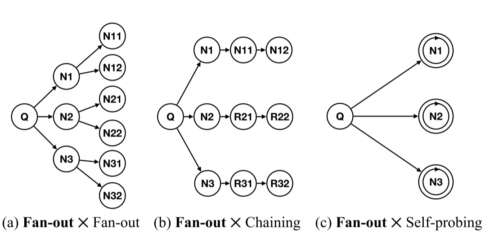
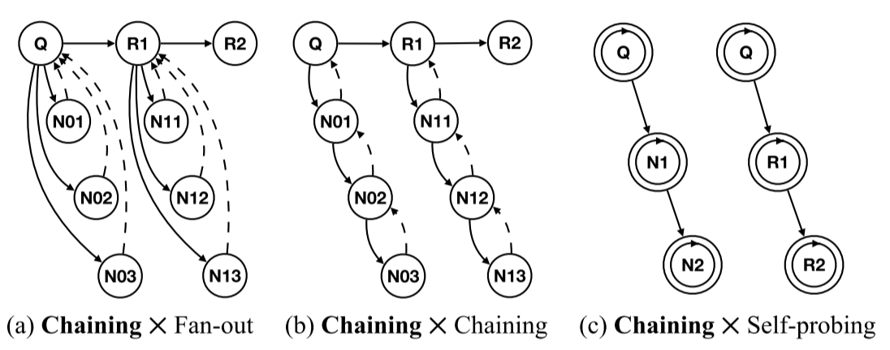

# CAMP: Compositional Amplification Attacks against DNS

## 背景

+ 过去基于DNS反射攻击
  + 基于传输层
  + 返回的消息多于发送的消息
  + 过大的响应会触发TCP回退，导致额外的消息交换
+ 新型针对DNS服务器的DoS攻击
  + 基于应用层
  + 单个客户端请求触发大量解析器查询

## 意义

## 方案

+ 在目标或辅助名称服务器上设置带有特制记录的DNS区域
+ DNS放大
  + 扇形（扩散）
  + 链式
  + 自探测

通过XDAuth攻击面，攻击者跨逻辑权限边界注入任意资源记录，并在没有权限的情况下秘密劫持域名，致使目标域名无法访问；在应用层，通过多种DNS放大攻击漏洞的组合，产生规模巨大的针对DNS服务器的DoS攻击，瘫痪DNS服务