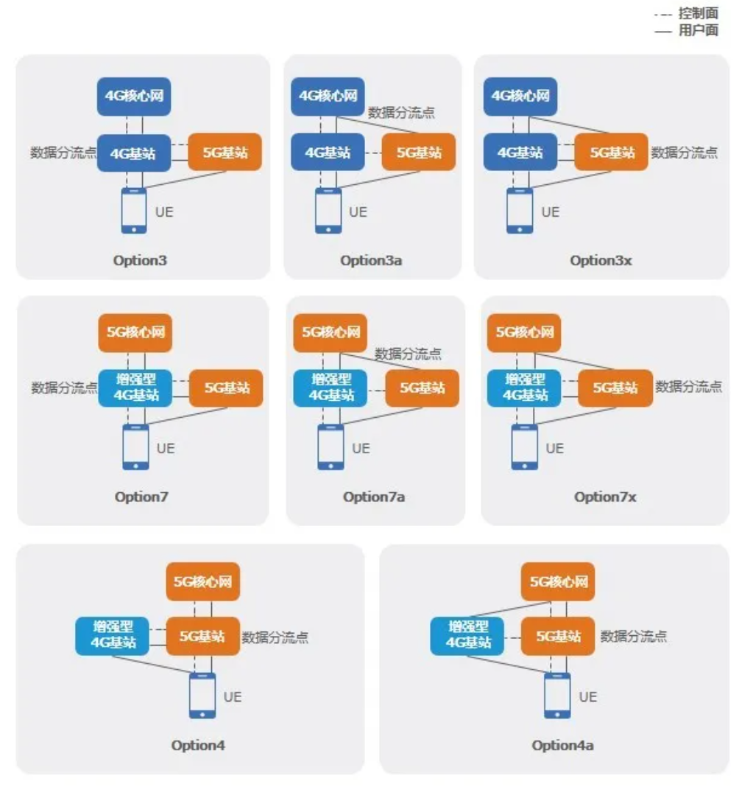

# 5G基础原理技术

[TOC]

---

## 01 5G is ON

### 1. 5G时代挑战

+ **超高速率**
+ **超多连接**
+ **超低时延**

#### ITU-R([国际电信联盟无线电通信部门 - 维基百科，自由的百科全书 (wikipedia.org)](https://zh.wikipedia.org/wiki/国际电信联盟无线电通信部门))定义5G三大类应用场景

+ 增强型移动互联网业务eMBB(Enhanced Mobile Broadband)

  增强型MBB

  10 Gbit/s

  适用于高清视频、虚拟现实、云游戏和下载等大容量数据的传输

+ 海量连接的互联网业务mMTC(Massive Machine Type Communication)

  每平方公里100万连接

  智能家居、智能城市和工业自动化等应用

+ 超高可靠性与超低时延业务uRLLC(Ultra Reliable & Low Latency Communication)

  1ms

  实时控制、医疗和自动驾驶

这三个应用场景之间存在一些联系：

1. 技术支持：eMBB、uRLLC和mMTC都依赖于5G技术的支持，如高频段的毫米波、大规模MIMO和网络切片等技术。
2. 网络架构：eMBB、uRLLC和mMTC都需要在5G网络中有对应的网络架构支持，如网络切片和灵活的资源分配。
3. 互补关系：eMBB、uRLLC和mMTC是在不同的应用场景下提供不同服务的，它们相互补充，共同构成了5G网络的全面能力。

eMBB、uRLLC和mMTC在5G技术中扮演不同的角色，满足不同的应用需求，共同推动了5G技术的发展和应用。

#### VR(Virtual Reality)/AR(Augmented Reality)/MR(Mixed Reality)等业务对速率提出更高需求

+ VR: Oculus Rift, Touch
+ AR: HoloLens
+ MR: Magic Leap

+ 沉浸感
+ 交互性
+ 多维度感知
+ 全息

#### Cloud VR需要5G的高速率

+ 主要是带宽和时延的高需求
+ 入门需要100Mbps带宽和10ms时延
+ 极致体验需要9.4Gbps和2ms的低时延

#### 大规模物联网需要5G网络的强大连接力

智慧城市通过5G网络协同工作，维护成本低、运营效率高。

#### 自动驾驶需要5G超低时延

+ 4G网络小于50ms，难以满足需求
+ 5G可达1ms的超低时延，100km/h的汽车发现障碍到哦启动制动系统仅需要3.3cm，有望达到汽车ABS水平

### 2. 5G**的关键性能目标**（与LTE对比）

[什么是4G LTE？4G不等于LTE！深入讲解4G和LTE的核心特点 - 知乎 (zhihu.com)](https://zhuanlan.zhihu.com/p/663058471)

**5G:**

+ 端到端时延1ms

  LTE 30~50ms

+ 每个连接吞吐率10Gbps

  LTE 100Mbps

+ 每平方公里100万

  LTE 10K

+ 能力需求：切片 NFV/SDN

---

## 02 NSA、SA架构

### 1. NSA和SA概述

3GPP（[3GPP - 维基百科，自由的百科全书 (wikipedia.org)](https://zh.wikipedia.org/wiki/3GPP)）定义，5G标准分为**NSA（非独立组网）**和**SA（独立组网）**

+ NSA(Non-Standalone) 
  1. 4G和5G基站并存
  2. 一种基站作为控制面的锚点，另外一种基站依赖锚点接入核心网
  3. 4G退网和5G引入的过渡型架构
+ SA(Standalone) 
  1. 无线侧只存在单一种类的基站
  2. 终极目标是5G基站+5G核心网

### 2. NSA架构

​	以Option3系列为例

+ 控制面信令通过4G基站与4G核心网交互完成

  4G主站作为主站，5G基站作为从站

+ 数据面多种路径传输，存在数据分流点

  Option3x数据分流基于数据包，分流点位于5G基站

  用户面数据通过5G基站分流到4G基站上承载，其余位于5G基站

