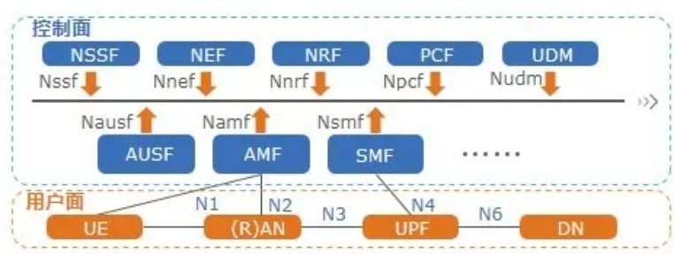

# 5G基础原理技术

[TOC]

---

## 01 5G is ON

### 1. 5G时代挑战

+ **超高速率**
+ **超多连接**
+ **超低时延**

#### ITU-R([国际电信联盟无线电通信部门 - 维基百科，自由的百科全书 (wikipedia.org)](https://zh.wikipedia.org/wiki/国际电信联盟无线电通信部门))定义5G三大类应用场景

+ 增强型移动互联网业务eMBB(Enhanced Mobile Broadband)

  增强型MBB

  10 Gbit/s

  适用于高清视频、虚拟现实、云游戏和下载等大容量数据的传输

+ 海量连接的互联网业务mMTC(Massive Machine Type Communication)

  每平方公里100万连接

  智能家居、智能城市和工业自动化等应用

+ 超高可靠性与超低时延业务uRLLC(Ultra Reliable & Low Latency Communication)

  1ms

  实时控制、医疗和自动驾驶

这三个应用场景之间存在一些联系：

1. 技术支持：eMBB、uRLLC和mMTC都依赖于5G技术的支持，如高频段的毫米波、大规模MIMO和网络切片等技术。
2. 网络架构：eMBB、uRLLC和mMTC都需要在5G网络中有对应的网络架构支持，如网络切片和灵活的资源分配。
3. 互补关系：eMBB、uRLLC和mMTC是在不同的应用场景下提供不同服务的，它们相互补充，共同构成了5G网络的全面能力。

eMBB、uRLLC和mMTC在5G技术中扮演不同的角色，满足不同的应用需求，共同推动了5G技术的发展和应用。

#### VR(Virtual Reality)/AR(Augmented Reality)/MR(Mixed Reality)等业务对速率提出更高需求

+ VR: Oculus Rift, Touch
+ AR: HoloLens
+ MR: Magic Leap

+ 沉浸感
+ 交互性
+ 多维度感知
+ 全息

#### Cloud VR需要5G的高速率

+ 主要是带宽和时延的高需求
+ 入门需要100Mbps带宽和10ms时延
+ 极致体验需要9.4Gbps和2ms的低时延

#### 大规模物联网需要5G网络的强大连接力

智慧城市通过5G网络协同工作，维护成本低、运营效率高。

#### 自动驾驶需要5G超低时延

+ 4G网络小于50ms，难以满足需求
+ 5G可达1ms的超低时延，100km/h的汽车发现障碍到哦启动制动系统仅需要3.3cm，有望达到汽车ABS水平

### 2. 5G**的关键性能目标**（与LTE对比）

[什么是4G LTE？4G不等于LTE！深入讲解4G和LTE的核心特点 - 知乎 (zhihu.com)](https://zhuanlan.zhihu.com/p/663058471)

**5G:**

+ 端到端时延1ms

  LTE 30~50ms

+ 每个连接吞吐率10Gbps

  LTE 100Mbps

+ 每平方公里100万

  LTE 10K

+ 能力需求：切片 NFV/SDN

---

## 02 NSA、SA架构

### 1. NSA和SA概述

3GPP（[3GPP - 维基百科，自由的百科全书 (wikipedia.org)](https://zh.wikipedia.org/wiki/3GPP)）定义，5G标准分为**NSA（非独立组网）**和**SA（独立组网）**

+ NSA(Non-Standalone) 
  1. 4G和5G基站并存
  2. 一种基站作为控制面的锚点，另外一种基站依赖锚点接入核心网
  3. 4G退网和5G引入的过渡型架构
+ SA(Standalone) 
  1. 无线侧只存在单一种类的基站
  2. 终极目标是5G基站+5G核心网

### 2. NSA架构

**以Option3系列为例**

[5G架构演进 - 知乎 (zhihu.com)](https://zhuanlan.zhihu.com/p/33042535)

+ 控制面信令通过4G基站与4G核心网交互完成

  [如何区分用户面，控制面，数据面，管理面等相关概念-CSDN博客](https://blog.csdn.net/weixin_45766278/article/details/126823087)

  [信令 - 维基百科，自由的百科全书 (wikipedia.org)](https://zh.wikipedia.org/wiki/信令)

  4G主站作为主站，5G基站作为从站

+ 数据面多种路径传输，存在数据分流点

  Option3x数据分流基于数据包，分流点位于5G基站

  用户面数据通过5G基站分流到4G基站上承载，其余位于5G基站

### 3. SA组网架构

### 4. 5GC网络架构演进方案

5GC（5G核心网）[你可以了解的5GC - 知乎 (zhihu.com)](https://zhuanlan.zhihu.com/p/663241513)

Option3

+ 只需要引入5G无线系统和升级EPC支持5G业务，利于加快5G部署实现网络灵活过渡，因此是很多运营商在5G部署初期采用的组网方案。

主推Option3系作为一个中间态

+ 这样的好处是终端、无线、核心网改动最小，用户能最快体验5G服务

Option2则作为网络长期演进的最终方案

Option7和Option4作为可选组网方案。典型组网方案如下图所示:

---

## 03 SA关键技术

### 1. 背景

5G网络需要更灵活的架构，以适应不同环境的业务需求。

**当前3GPP协议**

+ 定义的网元功能组合复杂
+ 存在功能重叠，无法做到为某一种特定的业务类型定制控制功能组合
+ 因此所有不同的业务将共用同一套逻辑控制功能，众多控制功能间的紧耦合性以及网元间接口的复杂性给业务的上线、网络的运维带来了极大的困难，**其灵活性不足以支撑5G时代的多业务场景。**

[什么是主机安全服务_主机安全服务（新版）HSS_产品介绍 (huaweicloud.com)](https://support.huaweicloud.com/productdesc-hss2.0/hss_01_0001.html)

[几篇关于【核心网】MME、PGW、SGW和PCRF的介绍-CSDN博客](https://blog.csdn.net/Rong_Toa/article/details/94983607)

### 2. SBA架构

适应未来业务，结合IT的**Cloud Native（云原生）**理念，5G架构进行变革：

[什么是云原生？这回终于有人讲明白了 - 知乎 (zhihu.com)](https://zhuanlan.zhihu.com/p/150190166)

> [!Note]
>
> 高度容器化，因此需Docker+k8s

+ 控制面抽象为多个独立网络服务

  + 模块化
  + 软件化
  + 服务化

+ 控制面和用户面分离

  用户面摆脱中心化，既可以灵活部署于核心网，也可以不属于更靠近用户的接入网。

每个网络服务和其他服务在业务功能上解耦，并且对外提供服务化接口，可以通过相同的接口向其它调用者提供服务，将多个摆合接口转变为单一服务接口，从而减少了接口数量。这种架构即是**SBA( Service BasedArchitecture)**，基于服务的架构。

面向“**Cloud Native**"定义服务是SBA架构的优势:

+ 模块化便于定制:每个5G软件功能由细粒度的”服务”来定义，便于网络按照业务场景以”服务”为粒度定制及编排。

+ 轻量化易于扩展:接口基于互联网协议，采用可灵活调用的API交互。

  对内降低网络配置及信令开销，对外提供能力开放的统一接口。

+ 独立化利于升级:服务可独立部署、灰度发布，使得网络功能可以快速升级引入新功能。服务可基于虚拟化平台快速部署和弹性扩缩容。

### 3. SBA关键特征

云原生+NFV（网络功能虚拟化）+SDN（软件定义网络）

1. 网络功能解耦

2. 网络服务无状态

   [无状态服务（stateless service）-阿里云开发者社区 (aliyun.com)](https://developer.aliyun.com/article/59799#:~:text=无状态服务（stateless,service）对单次请求的处理，不依赖其他请求，也就是说，处理一次请求所需的全部信息，要么都包含在这个请求里，要么可以从外部获取到（比如说数据库），服务器本身不存储任何信息)

   无状态服务（stateless service）对单次请求的处理，不依赖其他请求，也就是说，处理一次请求所需的全部信息，要么都包含在这个请求里，要么可以从外部获取到（比如说数据库），服务器本身不存储任何信息。

3. 控制面内网络功能间全服务化接口

4. 网络服务自发现、自制理，NRF自动发现网络服务，自动化部署，网络敏捷

   [5G Network Repository Function (NRF) | Oracle](https://www.oracle.com/communications/service-providers-network/products/5g-network-repository-function/)

5. CUPS（控制面和用户面分离）作为5GC的基本框架

   [【一望5G】技术专题 | CUPS & MEC - 知乎 (zhihu.com)](https://zhuanlan.zhihu.com/p/445855697)

6. 网络切片

   [5G网络切片技术解析，一文让你读懂5G切片_5g切片详解 csdn-CSDN博客](https://blog.csdn.net/weixin_45994747/article/details/110132668)

#### 网络功能解耦

EPC网络（4G核心网[EPC （4G核心网） (zte.com.cn)](https://sdnfv.zte.com.cn/zh-CN/vocabularys/EPC)）中，PCRF，MME，GW都可以控制QoS，手机用户在激活时，通过协商确定QoS。

**在5G中，将QoS的控制功能模块化，形成一个功能模块PCF(Policy Control Function)。**

[【5G核心网】 5GC核心网之网元PCF_5g pcf-CSDN博客](https://blog.csdn.net/zhonglinzhang/article/details/107877819)

又如SMF(Session Management Function)，就是将MME，SGW，PW上的会话管理功能模块化。

**在5G中，就是将这些网络功能解耦，抽象为独立的网络服务，便于后续这些服务灵活支撑网络各种应用。**

如下图所示，我们用不同的颜色来类比了解EPC的网元的相关功能在5GC中NF(Network Function)的归属。

#### 服务化接口

基于SBA，NF采用

+ 基于服务化架构的SBI(service based interface)串行总线接口协议.
+ 服务化接口统一采用HTTP/2协议，上层服务均使用HTTP协议进行消息传输。
+ 传输协议相同，所有的服务化接口就可以在同一总线上进行传输，支撑业务灵活上线。

应用到每个NF身上即为服务化接口，也就是上面提到的Nxxx接口(Namf、Nsmf......)。

因为底层的传输方式相同，所有的服务化接口就可以在同一总
线(如下图中的黑线)上进行传输，这种通信方式可以理解为总线通信方式。

所谓的”总线”在实际部署中是一台或几台路由器。与目前的4G网络中DRA（路由代理节点，[What is a Diameter Routing Agent (DRA)? | F5](https://www.f5.com/glossary/diameter-routing-agent-dra)）不同的是，DRA本身是感知3GPP层协议的，如基于用户的号段、签约信息等3GPP层消息进行转发，但**5G服务化架构中的控制面“总线”只进行基于路由器3/4层协议的转发，而不会感知高层的协议。**

5GC中，协议提供了两种形式的参考点

+ 基于服务化接口的参考点，例如控制面NF之间的交互关
  系。
+ 基于传统点对点通信的参考点，例如NF与无线以及外部数据网络连接时的交互关系。

控制面体现基于服务化接口的参考点，如下图中N11、N12等红色部分。

控制面和UPF，5GC和无线侧以及外部网络连接时，仍然是基于传统的点对点通信参考点，如N1、N2等青色所示部分。

#### 网络自发现
