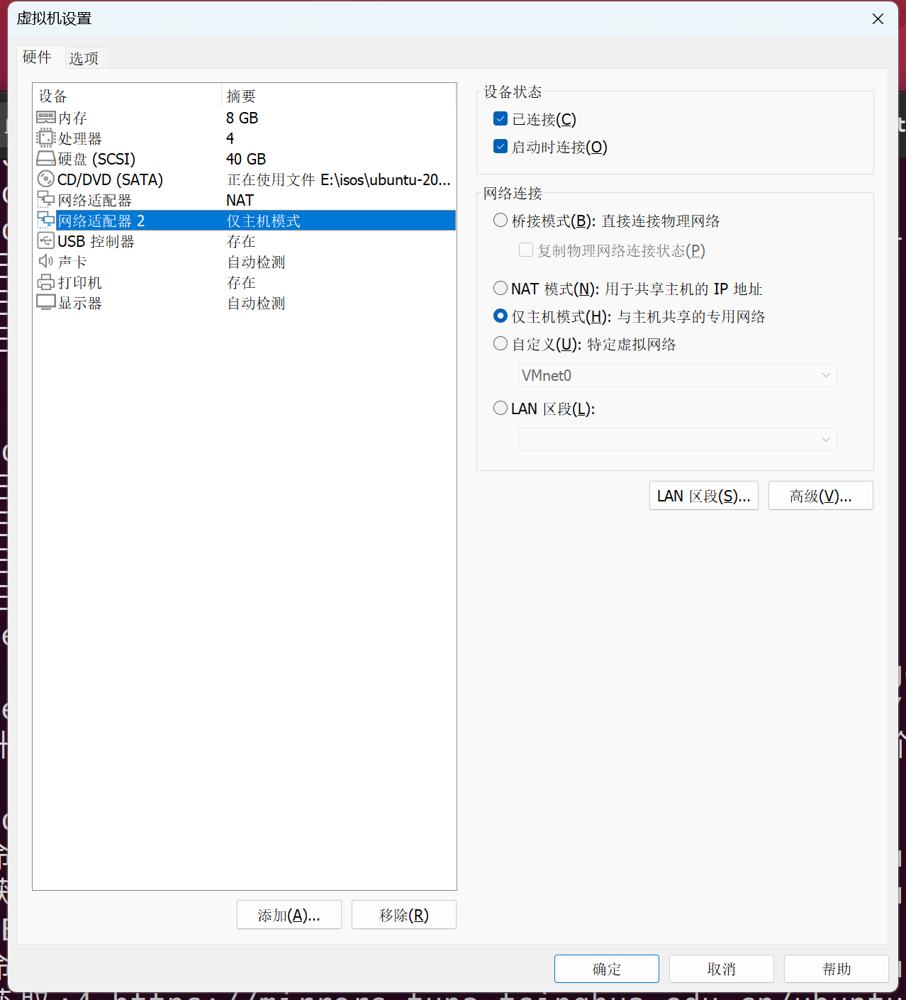

# Ubuntu20.04虚拟机搭建

[TOC]

### 1. 自定义创建新的虚拟机

### 2. 硬件兼容性选择默认的16.X

### 3. 下一步选择安装系统**一定要选择稍后安装操作系统**

（直接安装会产生诸多bug，原因未知）

### 4. 选择Linux-Ubuntu64位

### 5. 条件允许建议多给几个核

### 6. 条件允许建议多给些内存

### 7. 先选择一个NAT网卡

### 8. 创建新的虚拟磁盘

### 9. 条件允许建议多给些硬盘

### 10. 将虚拟磁盘拆分为多个文件

### 11. 自定义硬件

### 12. 移除打印机并创建一个仅主机模式的网卡

### 13. 使用iso文件安装Ubuntu

### 14. 开机

### 15. 这两个选项都不选

### 16. **清除整个磁盘并安装Ubuntu**

### 17. 设置主机名和密码

### 18. 完成安装

> [!Warning]
>
> 记住及时保存快照（建议关机状态下进行）