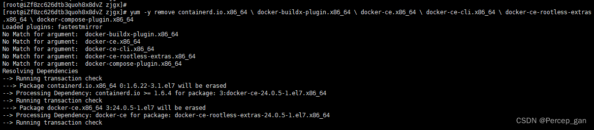
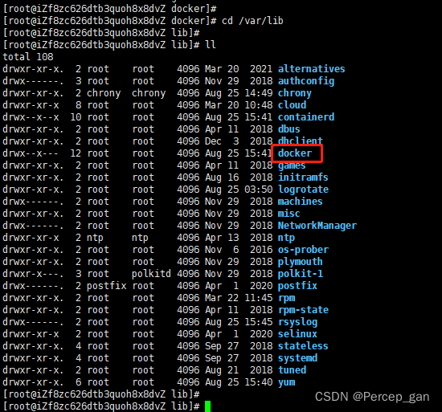
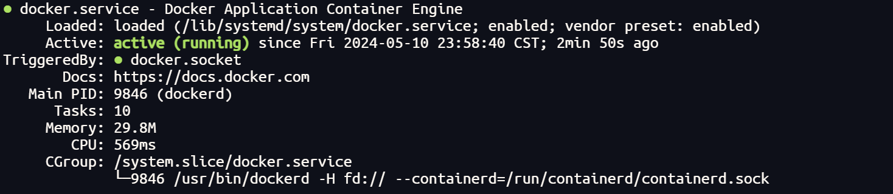
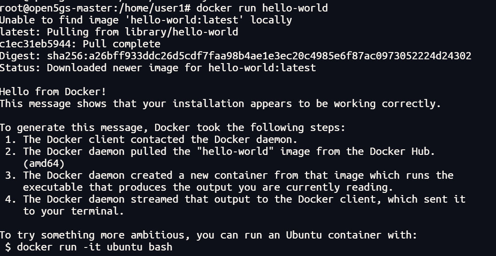

# Docker安装操作

[TOC]

## 0 docker与docker-compose的安装

### 1. docker的安装

https://mirrors.tuna.tsinghua.edu.cn/help/docker-ce/

#### (1) 清理旧版

```bash
yum list installed | grep docker
```

如果无输出则不需其他操作

删除安装过docker的相关包：

```bash
yum -y remove containerd.io.x86_64 \ docker-buildx-plugin.x86_64 \ docker-ce.x86_64 \ docker-ce-cli.x86_64 \ docker-ce-rootless-extras.x86_64 \ docker-compose-plugin.x86_64
```



删除与docker相关的软件包

```bash
yum remove -y docker*
```

删除docker相关的镜像和容器（存放在/var/lib）



直接rm -f

```bash
rm -rf docker
```

#### (2) 安装docker

设置镜像

```bash
yum-config-manager --add-repo http://mirrors.aliyun.com/docker-ce/linux/centos/docker-ce.repo
```

安装最新版本的docker

```bash
yum install -y docker-ce docker-ce-cli containerd.io
```

#### (3) 验证docker

```bash
systemctl start docker # 启动
systemctl stop docker # 关闭
systemctl status docker # 查看状态
systemctl enable docker # 开机自启
```



运行hello-world

```bash
docker run hello-world
```




### 2. docker-compose的安装

安装docker-compose

```bash
#下载docker-compose文件
curl -L https://github.com/docker/compose/releases/download/1.21.1/docker-compose-`uname -s`-`uname -m` -o /usr/local/bin/docker-compose

#将文件复制到/usr/local/bin环境变量下面
mv docker-compose /usr/local/bin

#给他一个执行权限
chmod +x /usr/local/bin/docker-compose

#查看是否安装成功
docker-compose -version
```

卸载docker-compose

```bash
# 卸载docker-compose
rm  /usr/local/bin/docker-compose
```

## 1 docker

端口映射

```bash
docker port kvpt
```


## 2 docker-compose

### 1. 启动和关闭（同时移除容器）

```bash
docker-compose up
docker-compose down
```

### 2. 启动和关闭（不移除容器）

```bash
docker-compose start
docker-compose stop
```

### 3. 列出由 docker compose 管理的容器的状态

```bash
docker-compose ps
```

### 4. 列出日志

```bash
docker-compose logs
```

