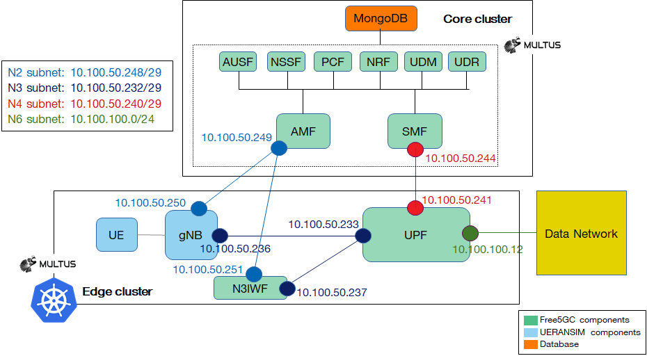

helm -n free5gc install free5gc-v1 /home/yan/towards5gs-helm/charts/free5gc --set global.n2network.masterIf=eth0,global.n4network.masterIf=eth0,global.n6network.masterIf=eth0,global.n9network.masterIf=eth0,global.n6network.subnetIP=10.244.0.0,global.n6network.gatewayIP=10.244.0.2,free5gc-upf.upf.n6if.ipAddress=10.244.0.20

helm -n free5gc install free5gc-v1 /home/user1/towards5gs-helm/charts/free5gc --set global.n2network.masterIf=eth0,global.n4network.masterIf=eth0,global.n6network.masterIf=eth0,global.n9network.masterIf=eth0,global.n6network.subnetIP=192.168.10.0,global.n6network.gatewayIP=192.168.40.2,free5gc-upf.upf.n6if.ipAddress=192.168.10.20



k8s常用命令速查

https://www.cnblogs.com/maobuji/p/13091537.html

helm install 8080端口不可达

```bash
kubectl config view --raw > ~/.kube/config
```

microk8s安装后查status一直卡住

为microk8s设置代理

修改pod的sandbox pod的sandbox 默认是 k8s.gcr.io/pause:3.1，这个镜像是无法获取的。需要将[sandbox](https://www.zhihu.com/search?q=sandbox&search_source=Entity&hybrid_search_source=Entity&hybrid_search_extra={"sourceType"%3A"article"%2C"sourceId"%3A"85375349"})修改为国内可以获取的镜像。 

修改/var/snap/microk8s/current/args/kubelet。 

添加--pod-infra-container-image=s7799653/pause:3.1 

修改/var/snap/microk8s/current/args/containerd-template.toml的plugins -> plugins.cri -> sandbox_image为s7799653/pause:3.1 

重启服务  microk8s.stop microk8s.start 

https://www.jianshu.com/p/02fd2540fab2


强制删除terminating的namespace

https://www.cnblogs.com/zisefeizhu/p/13786053.html

命令行设置代理

https://blog.csdn.net/weixin_44120025/article/details/121353813

kubectl设置别名

```bash
snap alias microk8s.kubectl kubectl
```


helm install -n free5gc free5gc-helm ./free5gc/ \
--set global.n6network.subnetIP="192.168.40.0" \
--set global.n6network.gatewayIP="192.168.40.1" \
--set free5gc-upf.upf.n6if.ipAddress="192.168.40.135"
