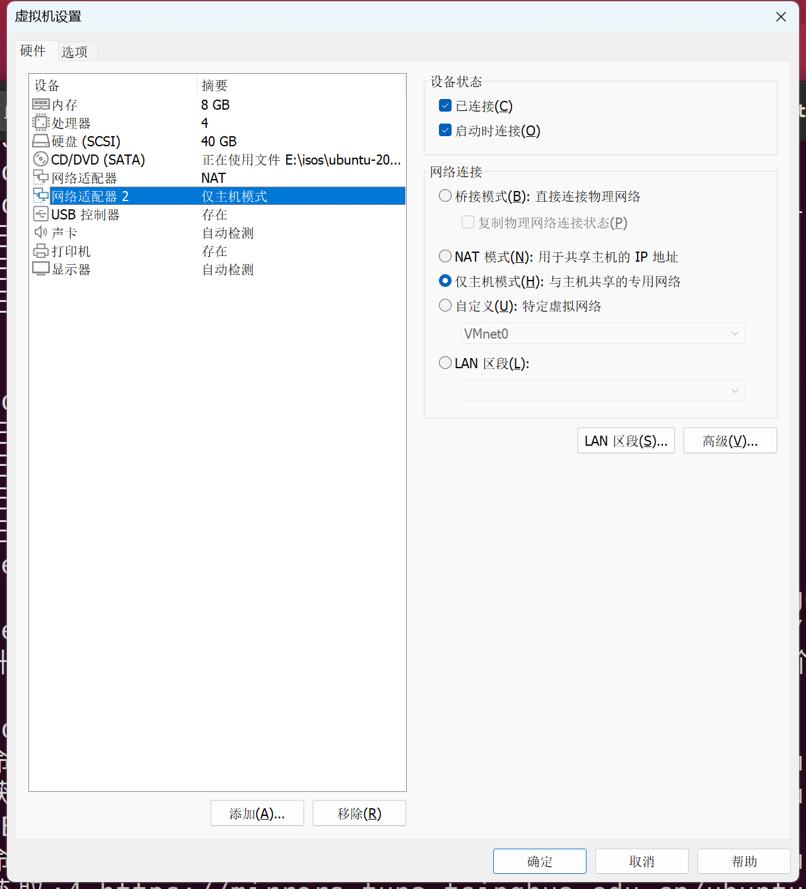
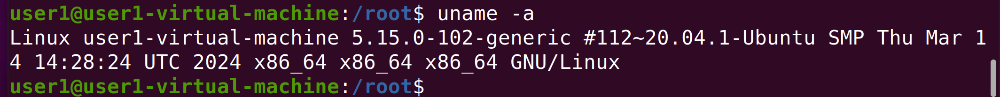
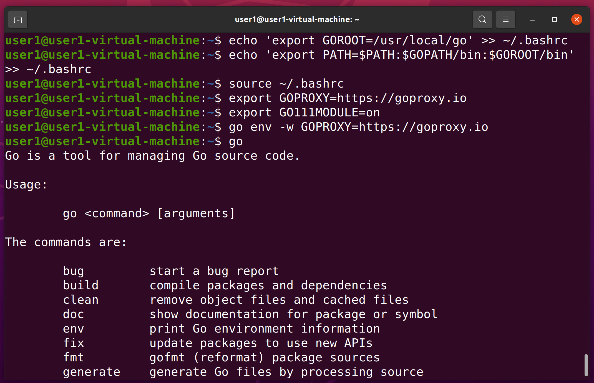
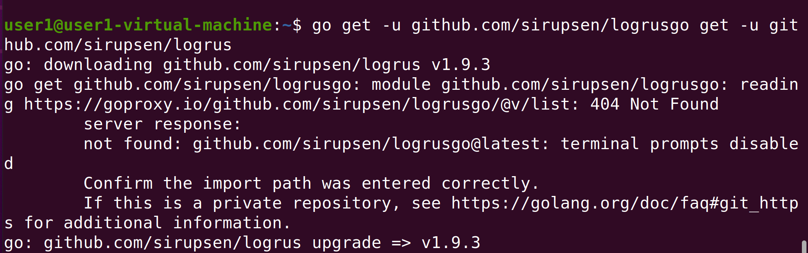

# Free5gc仿真环境搭建

[TOC]

## 一、准备工作

+ Vmware虚拟机
  
  采用版本为VMware® Workstation 16 Pro

+ Ubuntu20.04

  1. 自定义创建新的虚拟机
     

  2. 硬件兼容性选择默认的16.X
     

  3. 下一步选择安装系统**一定要选择稍后安装操作系统**
     （直接安装会产生诸多bug，原因未知）
     

  4. 选择Linux-Ubuntu64位
     

  5. 条件允许建议多给几个核
     

  6. 条件允许建议多给些内存
     

  7. 先选择一个NAT网卡
     

  8. 创建新的虚拟磁盘
     

  9. 条件允许建议多给些硬盘
     

  10. 将虚拟磁盘拆分为多个文件
      

  11. 自定义硬件
      

  12. 移除打印机并创建一个仅主机模式的网卡

      

  13. 使用iso文件安装Ubuntu
      

  14. 开机

  15. 这两个选项都不选

      

  16. **清除整个磁盘并安装Ubuntu**

      

  17. 设置主机名和密码

      

  18. 完成安装

+ 确认Linux内核，要求内核版本为**5.0.0-23-generic**或**5.4.0及之后**的版本

  ```bash
  uname -a
  ```

  

  若当前虚拟机内核版本不符合要求，则需要更换内核，使用以下命令安装`5.0.0-23-generic`的内核：

  ```bash
  sudo apt install 'linux-image-5.0.0-23-generic'
  sudo apt install 'linux-headers-5.0.0-23-generic'
  ```

  其他方法：

  https://blog.csdn.net/IronmanJay/article/details/132395150

  https://blog.csdn.net/qq_43472789/article/details/131082902

  安装完成后，需要重启虚拟机，并在启动时**连按shift**键，进入**grub**引导页，更换启动的Linux内核

+ apt安装必备组件

  ```bash
  sudo apt install git-all
  sudo apt-get install curl
  sudo apt install make
  sudo apt -y install gcc
  sudo apt -y install g++
  sudo apt -y install autoconf
  sudo apt -y install libtool
  sudo apt -y install pkg-config
  sudo apt -y install libmnl-dev
  sudo apt -y install libyaml-dev
  ```

  通过国内镜像源进行git clone

  ```bash
  git config --global url."https://hub.fastgit.org".insteadOf https://github.com
  ```

+ 安装go语言环境

  **注意安装go语言环境时必须为普通用户安装，否则会导致后续安装出现问题**

  输入命令`go`以确认是否存在其他版本的go

  

  若存在，则通过以下命令删除：

  ```bash
  sudo rm -rf /usr/local/go
  ```

  之后开始安装需要的go语言环境：

  ```bash
  cd ~
  wget https://dl.google.com/go/go1.15.7.linux-amd64.tar.gz 
  sudo tar -C /usr/local -zxvf go1.15.7.linux-amd64.tar.gz
  ```

  配置环境变量

  ```bash
  mkdir -p ~/go/{bin,pkg,src}
  echo 'export GOPATH=$HOME/go' >> ~/.bashrc
  echo 'export GOROOT=/usr/local/go' >> ~/.bashrc
  echo 'export PATH=$PATH:$GOPATH/bin:$GOROOT/bin' >> ~/.bashrc
  source ~/.bashrc
  ```

  通过以下命令配置go语言模块下载代理，默认的模块下载地址由于神秘原因，不可用：

  ```bash
  #下面三条配置用于保证在不同go语言版本中配置代理一定生效，建议都执行
  export GOPROXY=https://goproxy.io
  export GO111MODULE=on
  go env -w GOPROXY=https://goproxy.io
  ```

  安装完成后，以普通用户权限运行命令`go`，确认是否安装成功

  

  若安装成功，再补充安装以下模块，该模块为free5gc独立部署的**日志模块，独立部署时必须安装**：

  ```bash
  go get -u github.com/sirupsen/logrus
  ```

  

+ 安装docker

  通过官方安装脚本安装docker：

  ```bash
  curl -fsSL https://get.docker.com | bash -s docker --mirror Aliyun
  ```

  安装完成后，运行命令`docker --version`验证

  

  之后需要安装docker-compose，通过以下命令完成：

  ```bash
  sudo curl -L "https://github.com/docker/compose/releases/download/1.28.5/docker-compose-$(uname -s)-$(uname -m)" -o /usr/local/bin/docker-compose
  ```

  再之后，我们需要更换docker源，默认源下载速度过慢，会导致之后部署时出现下载超时错误：

  ```bash
  sudo vim /etc/docker/daemon.json
  ```

  写入内容：

  ```bash
  {"registry-mirrors": ["https://docker.mirrors.ustc.edu.cn"]}
  ```

  之后重启docker服务即可完成docker的部署：

  ```bash
  systemctl restart docker
  ```

  完成后，需要将当前**普通用户**加入docker用户组，docker用户组在上述安装时自动创建，无需手动创建：

  ```bash
  sudo gpasswd -a $USER docker #将当前普通用户加入docker用户组
  newgrp docker                #更新docker用户组
  ```

+ 安装cmake

  > [!Warning]
  >
  > **此处装的cmake，需要3.17及以上版本，否则后续UERANSIM环境搭建会出错。**
  
  方法 1：
  
  ```bash
  wget https://cmake.org/files/v3.20/cmake-3.20.0-rc3-linux-x86_64.tar.gz
  tar zxvf cmake-3.20.0-rc3-linux-x86_64.tar.gz
  sudo mv cmake-3.20.0-rc3-linux-x86_64 /opt/cmake-3.20.0
  sudo ln -sf /opt/cmake-3.20.0/bin/*  /usr/bin/
  ```
  
  此方法优势在于安装的cmake版本可控，其中第一步的wget建议手动下载，wget方式下载速度比较慢
  
  方法 2：
  
  ```bash
  sudo snap install cmake --classic
  ```
  
  此方法优势在于简单，一条命令执行即可
  
+ 安装mongodb

  ```bash
  sudo apt -y update
  sudo apt -y install mongodb wget git
  sudo systemctl start mongodb
  ```
  
  注：此组件为free5gc的数据库组件，为**free5gc独立部署**的必须步骤
  
+ 安装yarn

  ```
  curl -sS https://dl.yarnpkg.com/debian/pubkey.gpg | sudo apt-key add -
  echo "deb https://dl.yarnpkg.com/debian/ stable main" | sudo tee /etc/apt/sources.list.d/yarn.list
  sudo apt update && sudo apt install yarn
  ```
  
  注：此组件为free5gc的webui支持组件，为**free5gc独立部署**的必须步骤

## 二、free5gc容器化部署

### 1. 构建GTP5G模块

> [!Warning]
>
> **构建GTP5G模块时，需要用普通用户构建，否则后续使用时会出错**

+ 通过git clone下载项目代码：

  ```bash
  cd ~
  git clone https://github.com/PriczOwO/gtp5g.git
  cd gtp5g
  ```

+ 编译代码

  ```bash
  make
  sudo make install
  ```

> [!Tip]
>
> gtp5g模块是free5gc模拟核心网的内核模块，无论何种部署方案，都**必须安装**

### 2. 容器化部署free5gc模拟核心网

+ 通过git clone下载项目代码

  ```bash
  cd ~
  git clone https://github.com/free5gc/free5gc-compose.git
  cd free5gc-compose
  ```

+ 执行`make base`容器化安装free5gc核心网

  ```bash
  cd ~/free5gc-compose
  make base
  docker-compose build
  ```

+ 其中`docker-compose build`一步可能报版本错误，原因在于上面安装`docker、docker-compose`时可能安装了较低版本的`docker、docker-compose`，此时可以选择重装`docker、docker-compose`或者修改`docker-compose.yaml`文件中第一行版本号3.8为当前版本，建议优先选择重装`docker、docker-compose`，以回避未知错误

  通过命令`docker --version`命令查询当前版本，并对应下面链接中的表格：

  | **Compose file format** | **Docker Engine release** |
  | :---------------------: | :-----------------------: |
  |  Compose specification  |         19.03.0+          |
  |           3.8           |         19.03.0+          |
  |           3.7           |         18.06.0+          |
  |           3.6           |         18.02.0+          |
  |           3.5           |         17.12.0+          |
  |           3.4           |         17.09.0+          |
  |           3.3           |         17.06.0+          |
  |           3.2           |         17.04.0+          |
  |           3.1           |          1.13.1+          |
  |           3.0           |          1.13.0+          |
  |           2.4           |         17.12.0+          |
  |           2.3           |         17.06.0+          |
  |           2.2           |          1.13.0+          |
  |           2.1           |          1.12.0+          |
  |           2.0           |          1.10.0+          |
  |           1.0           |          1.9.1.+          |
  
  至此，free5gc容器化部署完成

## 三、UERANSIM模拟设备安装

### 1. 源代码下载

```bash
cd ~
git clone https://github.com/aligungr/UERANSIM
```

### 2. 依赖下载

```bash
sudo apt update
sudo apt upgrade
sudo apt install make
sudo apt install g++
sudo apt install libsctp-dev
sudo apt install lksctp-tools
sudo apt install iproute2
```

### 3. 编译源代码

```bash
cd ~/UERANSIM
make
```

