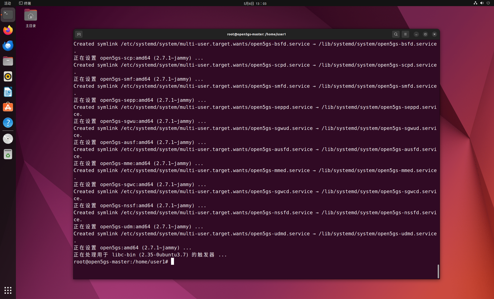

# Open5GS部署（非容器化 Ubuntu 22.04 LTS）

[TOC]

## 0 参考

https://open5gs.org/open5gs/docs/guide/01-quickstart/

https://medium.com/rahasak/5g-core-network-setup-with-open5gs-and-ueransim-cd0e77025fd7

https://medium.com/networkers-fiit-stu/setting-up-open5gs-a-step-by-step-guide-or-how-we-set-up-our-lab-environment-5da1c8db0439

https://medium.com/rahasak/5g-core-network-setup-with-open5gs-and-ueransim-cd0e77025fd7

https://ithelp.ithome.com.tw/articles/10305591

https://openatomworkshop.csdn.net/6605083c872a553575c0f8b5.html

## 1 Open5GS架构


### 4G/5G NSA Core

- MME - Mobility Management Entity
- HSS - Home Subscriber Server
- PCRF - Policy and Charging Rules Function
- SGWC - Serving Gateway Control Plane
- SGWU - Serving Gateway User Plane
- PGWC/SMF - Packet Gateway Control Plane / (component contained in Open5GS SMF)
- PGWU/UPF - Packet Gateway User Plane / (component contained in Open5GS UPF)

### 5G SA Core

- NRF - NF Repository Function
- SCP - Service Communication Proxy
- SEPP - Security Edge Protection Proxy
- AMF - Access and Mobility Management Function
- SMF - Session Management Function
- UPF - User Plane Function
- AUSF - Authentication Server Function
- UDM - Unified Data Management
- UDR - Unified Data Repository
- PCF - Policy and Charging Function
- NSSF - Network Slice Selection Function
- BSF - Binding Support Function

## 2 Open5GS安装

### 1. 安装MongoDB

#### (1) 导入软件包管理系统使用的公钥

```bash
sudo apt install gnupg
curl -fsSL https://pgp.mongodb.com/server-6.0.asc | sudo gpg -o /usr/share/keyrings/mongodb-server-6.0.gpg --dearmor
```

#### (2) 创建列表文件

```bash
echo "deb [ arch=amd64,arm64 signed-by=/usr/share/keyrings/mongodb-server-6.0.gpg] https://repo.mongodb.org/apt/ubuntu jammy/mongodb-org/6.0 multiverse" | sudo tee /etc/apt/sources.list.d/mongodb-org-6.0.list
```

#### (3) 安装MongoDB

```bash
sudo apt update
sudo apt install -y mongodb-org
sudo systemctl start mongod (if '/usr/bin/mongod' is not running)
sudo systemctl enable mongod (ensure to automatically start it on system boot)
```

### 2. 安装Open5GS

```bash
sudo add-apt-repository ppa:open5gs/latest
sudo apt update
sudo apt install open5gs
```



### 3. 安装OpenGS WebUI

#### (1) 先安装node.js

下载并导入 Nodesource GPG 密钥

```bash
sudo apt update
sudo apt install -y ca-certificates curl gnupg
sudo mkdir -p /etc/apt/keyrings
curl -fsSL https://deb.nodesource.com/gpgkey/nodesource-repo.gpg.key | sudo gpg --dearmor -o /etc/apt/keyrings/nodesource.gpg
```

创建 deb 库

```bash
NODE_MAJOR=20
echo "deb [signed-by=/etc/apt/keyrings/nodesource.gpg] https://deb.nodesource.com/node_$NODE_MAJOR.x nodistro main" | sudo tee /etc/apt/sources.list.d/nodesource.list
```

安装node.js

```bash
sudo apt update
sudo apt install nodejs -y
```

#### (2) 安装WebUI

```bash
curl -fsSL https://open5gs.org/open5gs/assets/webui/install | sudo -E bash -
```

### 4. WebUI的使用
