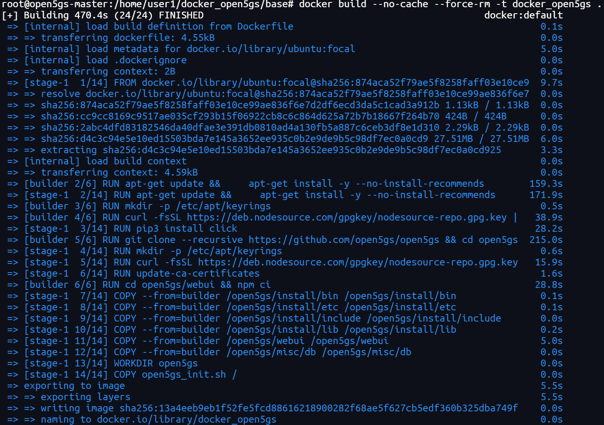
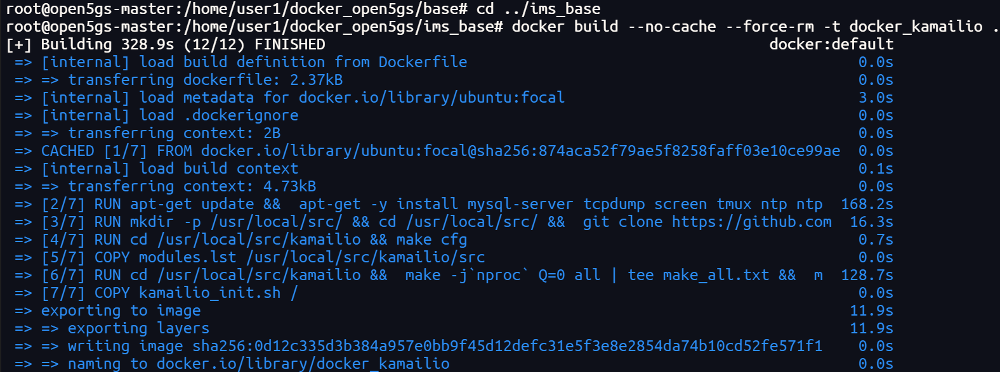
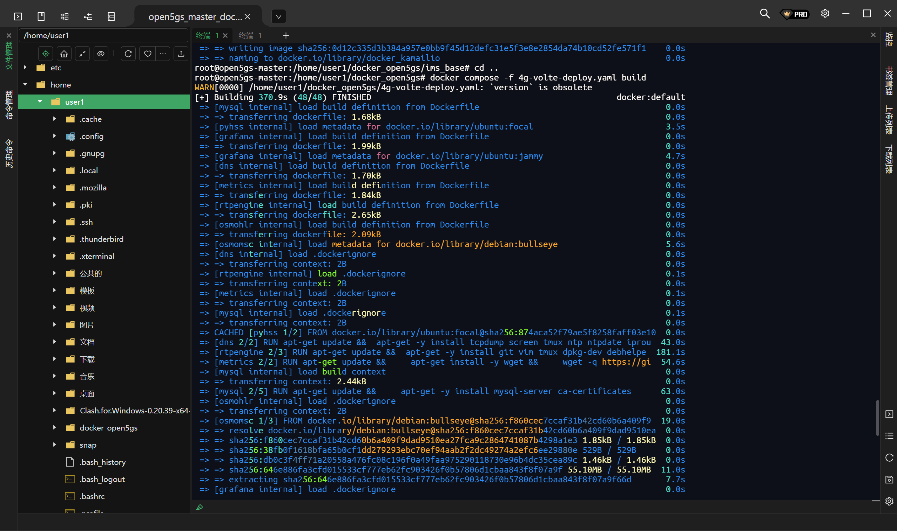
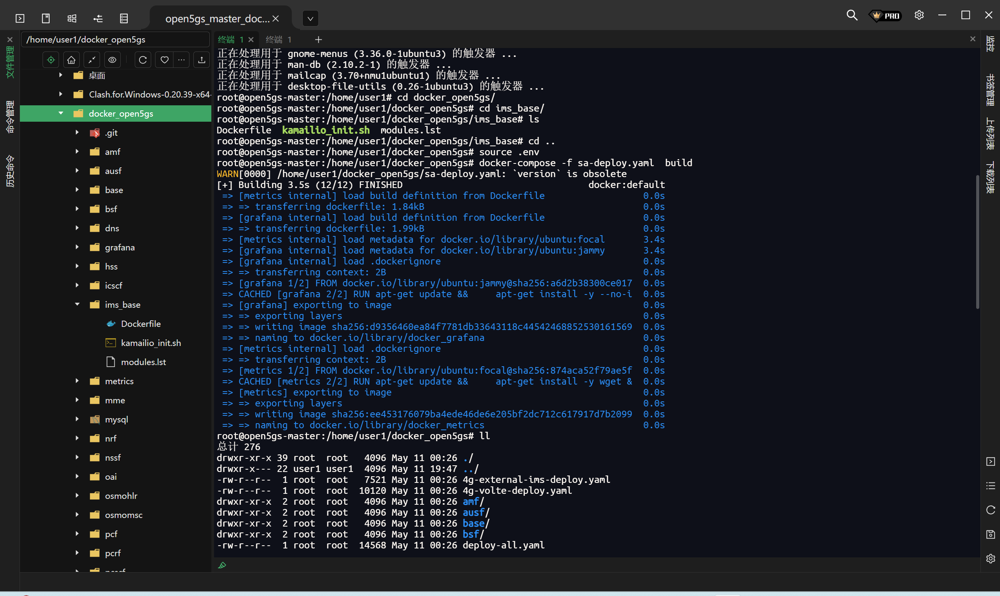
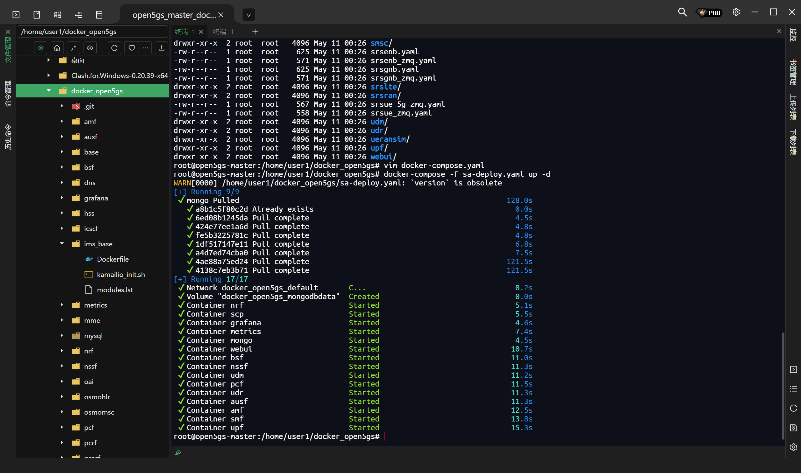
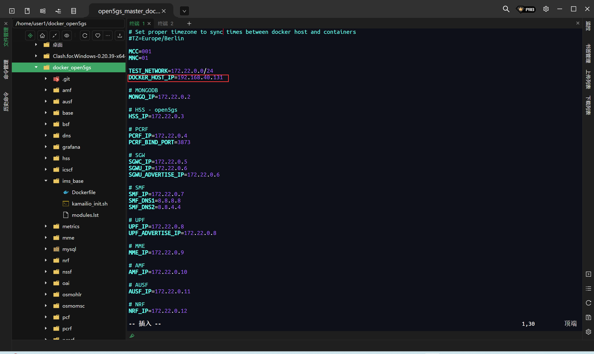

# 容器化部署open5gs(docker-compose)

[TOC]

参考：https://open5gs.org/open5gs/docs/tutorial/03-VoLTE-dockerized/

Open5GS + Kamailio IMS VoLTE

## 1 构建 Open5GS 和 Kamailio docker 映像

必备条件：
docker-ce - 版本 22.0.5 或以上
docker compose - 2.14 或更高版本

### 1. 克隆版本库并构建 open5gs 和 kamailio 的基础 docker 镜像：

```bash
git clone https://github.com/herlesupreeth/docker_open5gs
cd docker_open5gs/base
docker build --no-cache --force-rm -t docker_open5gs .
cd ../ims_base
docker build --no-cache --force-rm -t docker kamailio .
cd ..
source .env
docker-compose -f sa-dep1oy.yaml build
docker-compose -f sa-deploy.yaml up -d
```











