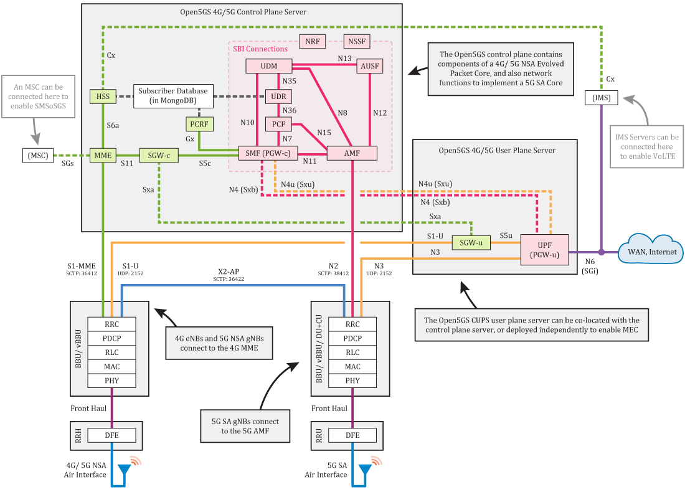
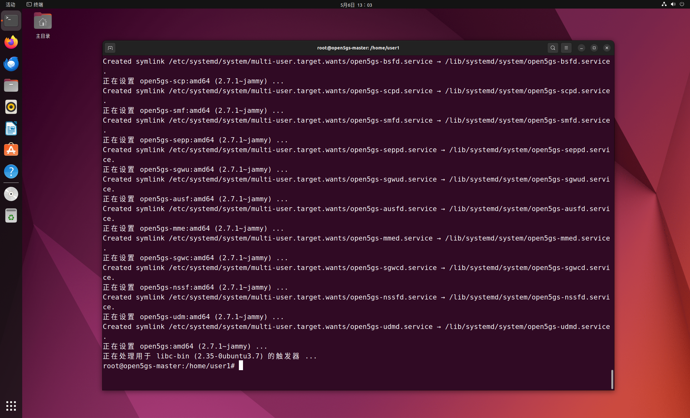
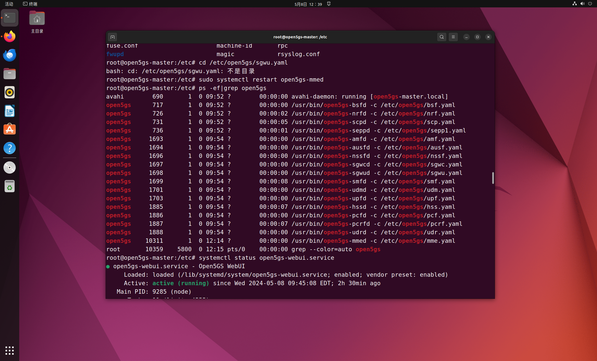
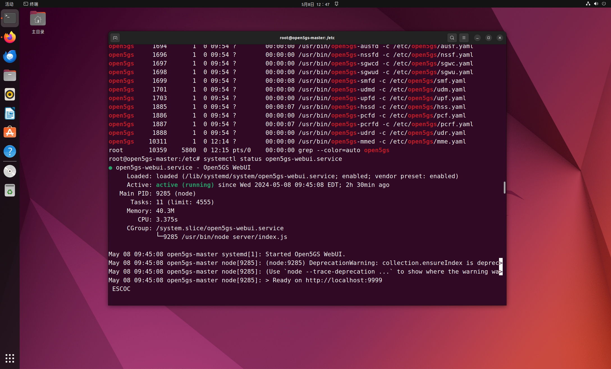
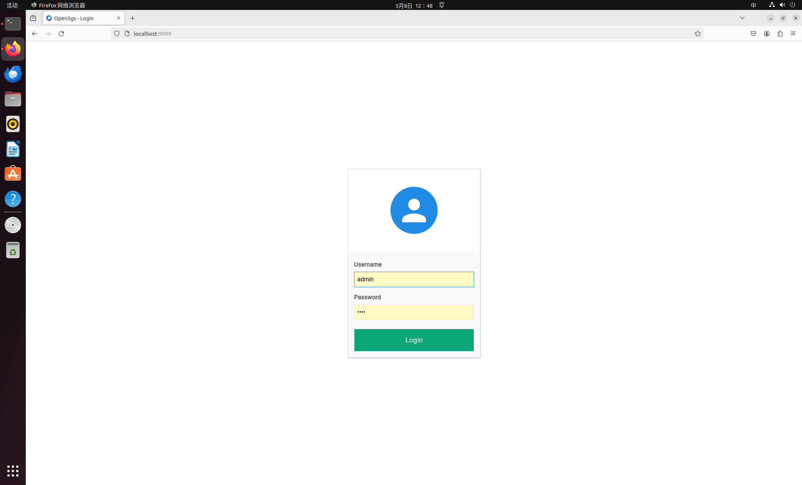
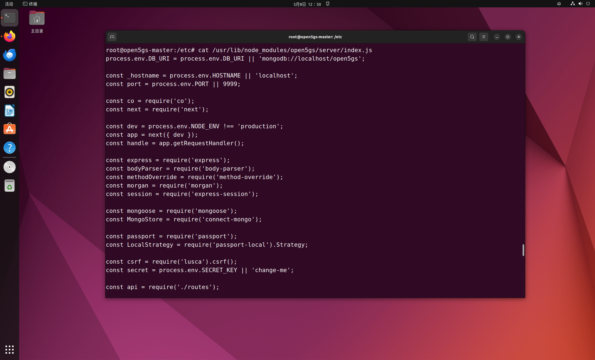

# Open5GS部署（非容器化 Ubuntu 22.04 LTS）

[TOC]

## 0 参考

https://open5gs.org/open5gs/docs/guide/01-quickstart/

https://medium.com/rahasak/5g-core-network-setup-with-open5gs-and-ueransim-cd0e77025fd7

https://medium.com/networkers-fiit-stu/setting-up-open5gs-a-step-by-step-guide-or-how-we-set-up-our-lab-environment-5da1c8db0439

https://medium.com/rahasak/5g-core-network-setup-with-open5gs-and-ueransim-cd0e77025fd7

https://ithelp.ithome.com.tw/articles/10305591

https://openatomworkshop.csdn.net/6605083c872a553575c0f8b5.html

## 1 Open5GS架构



### 4G/5G NSA Core

- MME - Mobility Management Entity
- HSS - Home Subscriber Server
- PCRF - Policy and Charging Rules Function
- SGWC - Serving Gateway Control Plane
- SGWU - Serving Gateway User Plane
- PGWC/SMF - Packet Gateway Control Plane / (component contained in Open5GS SMF)
- PGWU/UPF - Packet Gateway User Plane / (component contained in Open5GS UPF)

### 5G SA Core

- NRF - NF Repository Function
- SCP - Service Communication Proxy
- SEPP - Security Edge Protection Proxy
- AMF - Access and Mobility Management Function
- SMF - Session Management Function
- UPF - User Plane Function
- AUSF - Authentication Server Function
- UDM - Unified Data Management
- UDR - Unified Data Repository
- PCF - Policy and Charging Function
- NSSF - Network Slice Selection Function
- BSF - Binding Support Function

## 2 Open5GS安装

### 1. 安装MongoDB

#### (1) 导入软件包管理系统使用的公钥

```bash
sudo apt install gnupg
curl -fsSL https://pgp.mongodb.com/server-6.0.asc | sudo gpg -o /usr/share/keyrings/mongodb-server-6.0.gpg --dearmor
```

#### (2) 创建列表文件

```bash
echo "deb [ arch=amd64,arm64 signed-by=/usr/share/keyrings/mongodb-server-6.0.gpg] https://repo.mongodb.org/apt/ubuntu jammy/mongodb-org/6.0 multiverse" | sudo tee /etc/apt/sources.list.d/mongodb-org-6.0.list
```

#### (3) 安装MongoDB

```bash
sudo apt update
sudo apt install -y mongodb-org
sudo systemctl start mongod (if '/usr/bin/mongod' is not running)
sudo systemctl enable mongod (ensure to automatically start it on system boot)
```

### 2. 安装Open5GS

```bash
sudo add-apt-repository ppa:open5gs/latest
sudo apt update
sudo apt install open5gs
```



查看open5gs有关进程

```bash
ps -ef|grep open5gs
```



### 3. 安装OpenGS WebUI

#### (1) 先安装node.js

下载并导入 Nodesource GPG 密钥

```bash
sudo apt update
sudo apt install -y ca-certificates curl gnupg
sudo mkdir -p /etc/apt/keyrings
curl -fsSL https://deb.nodesource.com/gpgkey/nodesource-repo.gpg.key | sudo gpg --dearmor -o /etc/apt/keyrings/nodesource.gpg
```

创建 deb 库

```bash
NODE_MAJOR=20
echo "deb [signed-by=/etc/apt/keyrings/nodesource.gpg] https://deb.nodesource.com/node_$NODE_MAJOR.x nodistro main" | sudo tee /etc/apt/sources.list.d/nodesource.list
```

安装node.js

```bash
sudo apt update
sudo apt install nodejs -y
```

#### (2) 安装WebUI

```bash
curl -fsSL https://open5gs.org/open5gs/assets/webui/install | sudo -E bash -
```

### 4. WebUI的使用

重启webui服务

```bash
systemctl stop open5gs-webui.service
systemctl start open5gs-webui.service
```

查看webui服务状态
```bash
systemctl status open5gs-webui.service
```



可以看到运行在9999端口（非固定）



默认账户：

```bash
admin
1423
```

查看webui的ip和端口设置
```bash
cat /usr/lib/node_modules/open5gs/server/index.js
```



若要修改配置可vim编辑该文件

IP地址为localhost，如需外部访问可将此处localhost改为本地ip地址,端口号为9999

使用netstat -pan|grep 9999查看端口开放情况

### 5. 设置5G SA核心

修改 NRF 和 AMF 配置中的 PLMN，如果是 AMF，还需要进一步修改 TAC 信息。

国际测试 PLMN 为 001/01，国际专用网络 PLMN 为 999/99。您应坚持使用这两个 PLMN，除非您的国家监管机构向您发放了一个 PLMN。(该 PLMN 需要在 gNB 中配置）。

如果要将外部 gNB 连接到核心，还需要更改 AMF 的 NGAP 绑定地址和 UPF 的 GTPU 绑定地址。如果在本地运行 gNB 协议栈，则无需进行这些更改。

#### (1) 修改 /etc/open5gs/nrf.yaml 以设置服务 PLMN ID。

```bash
$ diff --git a/configs/open5gs/nrf.yaml.in b/configs/open5gs/nrf.yaml.in
index cd9e45feb..58e8cbbce 100644
--- a/configs/open5gs/nrf.yaml.in
+++ b/configs/open5gs/nrf.yaml.in
@@ -10,8 +10,8 @@ global:
 nrf:
   serving:  # 5G roaming requires PLMN in NRF
     - plmn_id:
-        mcc: 999
-        mnc: 70
+        mcc: 001
+        mnc: 01
   sbi:
     server:
       - address: 127.0.0.10
```

#### (2) 修改 /etc/open5gs/amf.yaml 以设置 NGAP IP 地址、PLMN ID、TAC 和 NSSAI。

```bash
$ diff --git a/configs/open5gs/amf.yaml.in b/configs/open5gs/amf.yaml.in
index 938917e32..35d0ab5aa 100644
--- a/configs/open5gs/amf.yaml.in
+++ b/configs/open5gs/amf.yaml.in
@@ -18,27 +18,27 @@ amf:
           - uri: http://127.0.0.200:7777
     ngap:
       server:
-        - address: 127.0.0.5
+        - address: 10.10.0.5
     metrics:
       server:
         - address: 127.0.0.5
           port: 9090
     guami:
       - plmn_id:
-          mcc: 999
-          mnc: 70
+          mcc: 001
+          mnc: 01
         amf_id:
           region: 2
           set: 1
     tai:
       - plmn_id:
-          mcc: 999
-          mnc: 70
+          mcc: 001
+          mnc: 01
         tac: 1
     plmn_support:
       - plmn_id:
-          mcc: 999
-          mnc: 70
+          mcc: 001
+          mnc: 01
         s_nssai:
           - sst: 1
     security:
```

#### (3) 修改 /etc/open5gs/upf.yaml 以设置 GTP-U 地址。

```bash
$ diff --git a/configs/open5gs/upf.yaml.in b/configs/open5gs/upf.yaml.in
index e78b018f1..35a54419e 100644
--- a/configs/open5gs/upf.yaml.in
+++ b/configs/open5gs/upf.yaml.in
@@ -15,7 +15,7 @@ upf:
 #          - address: 127.0.0.4
     gtpu:
       server:
-        - address: 127.0.0.7
+        - address: 10.11.0.7
     session:
       - subnet: 10.45.0.1/16
       - subnet: 2001:db8:cafe::1/48
```

#### (4) 重新启动 Open5GS 服务。

```bash
$ sudo systemctl restart open5gs-nrfd
$ sudo systemctl restart open5gs-amfd
$ sudo systemctl restart open5gs-upfd
```

sudo systemctl restart open5gs-mmed
sudo systemctl restart open5gs-sgwcd
sudo systemctl restart open5gs-smfd
sudo systemctl restart open5gs-amfd
sudo systemctl restart open5gs-sgwud
sudo systemctl restart open5gs-upfd
sudo systemctl restart open5gs-hssd
sudo systemctl restart open5gs-pcrfd
sudo systemctl restart open5gs-nrfd
sudo systemctl restart open5gs-scpd
sudo systemctl restart open5gs-seppd
sudo systemctl restart open5gs-ausfd
sudo systemctl restart open5gs-udmd
sudo systemctl restart open5gs-pcfd
sudo systemctl restart open5gs-nssfd
sudo systemctl restart open5gs-bsfd
sudo systemctl restart open5gs-udrd
sudo systemctl restart open5gs-webui

sudo systemctl start open5gs-mmed 1
sudo systemctl start open5gs-sgwcd 1
sudo systemctl start open5gs-smfd 1
sudo systemctl start open5gs-amfd 0
sudo systemctl start open5gs-sgwud 1
sudo systemctl start open5gs-upfd 0
sudo systemctl start open5gs-hssd 1
sudo systemctl start open5gs-pcrfd 1
sudo systemctl start open5gs-nrfd 1
sudo systemctl start open5gs-scpd 1
sudo systemctl start open5gs-seppd 1
sudo systemctl start open5gs-ausfd 1
sudo systemctl start open5gs-udmd 1
sudo systemctl start open5gs-pcfd 1
sudo systemctl start open5gs-nssfd 1
sudo systemctl start open5gs-bsfd 1
sudo systemctl start open5gs-udrd 1
sudo systemctl start open5gs-webui
