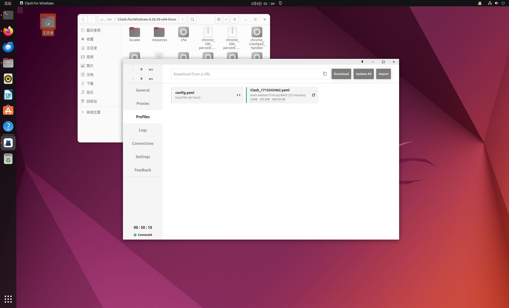
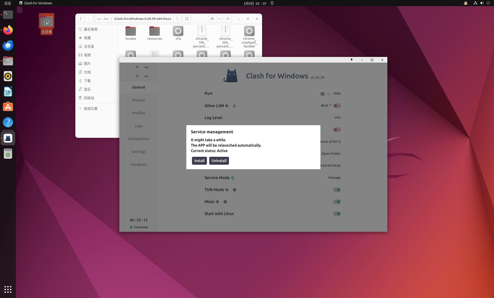
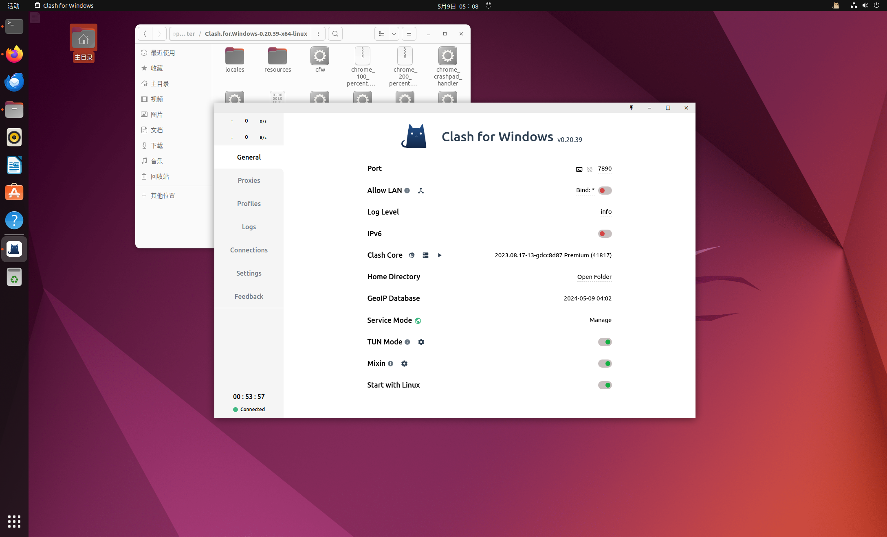
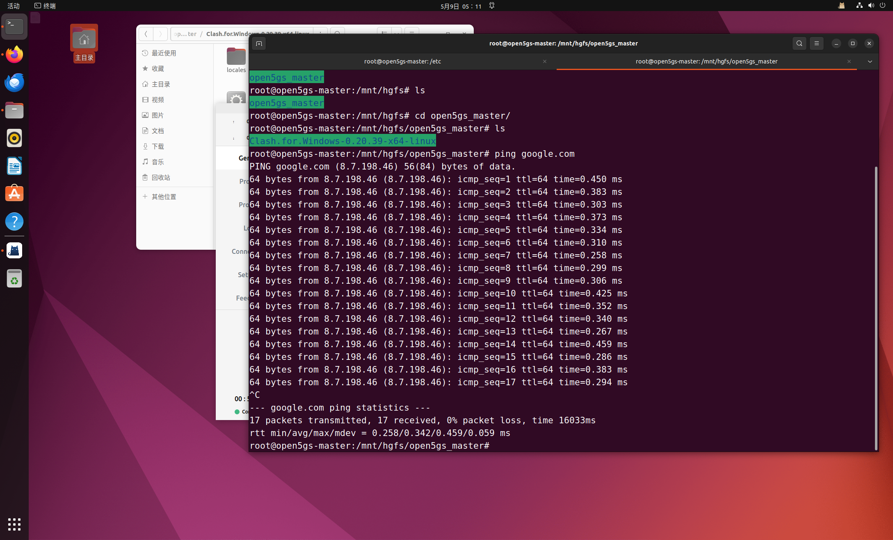
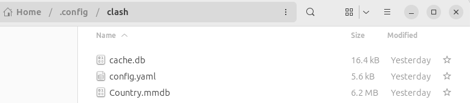
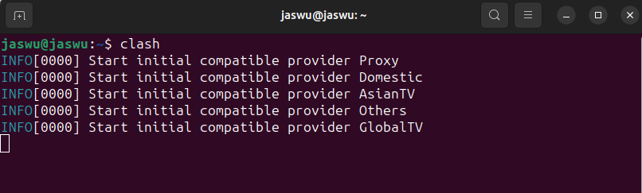

# 其他工具

[TOC]

## 1. Open-VM-tools

#### 功能

+ 自适应虚拟机分辨率
+ 虚拟机和物理机切换
+ 互传文件
+ 共享剪切板

#### 安装

```bash
sudo apt install open-vm-tools
sudo apt install open-vm-tools-desktop
sudo apt-get install -y open-vm*
```

## 2. apt换源

#### 功能：

+ 解决安装速度过慢

#### 安装：

```bash
vim /etc/apt/sources.list
```

然后将内容替换为（以Ubuntu 22.04为例）：

（清华源：）

```txt
# 默认注释了源码镜像以提高 apt update 速度，如有需要可自行取消注释
deb https://mirrors.tuna.tsinghua.edu.cn/ubuntu/ jammy main restricted universe multiverse
# deb-src https://mirrors.tuna.tsinghua.edu.cn/ubuntu/ jammy main restricted universe multiverse
deb https://mirrors.tuna.tsinghua.edu.cn/ubuntu/ jammy-updates main restricted universe multiverse
# deb-src https://mirrors.tuna.tsinghua.edu.cn/ubuntu/ jammy-updates main restricted universe multiverse
deb https://mirrors.tuna.tsinghua.edu.cn/ubuntu/ jammy-backports main restricted universe multiverse
# deb-src https://mirrors.tuna.tsinghua.edu.cn/ubuntu/ jammy-backports main restricted universe multiverse

deb http://security.ubuntu.com/ubuntu/ jammy-security main restricted universe multiverse
# deb-src http://security.ubuntu.com/ubuntu/ jammy-security main restricted universe multiverse

# 预发布软件源，不建议启用
# deb https://mirrors.tuna.tsinghua.edu.cn/ubuntu/ jammy-proposed main restricted universe multiverse
# # deb-src https://mirrors.tuna.tsinghua.edu.cn/ubuntu/ jammy-proposed main restricted universe multiverse
```

（阿里云源）：

``````txt
deb https://mirrors.aliyun.com/ubuntu/ jammy main restricted universe multiverse
deb-src https://mirrors.aliyun.com/ubuntu/ jammy main restricted universe multiverse

deb https://mirrors.aliyun.com/ubuntu/ jammy-security main restricted universe multiverse
deb-src https://mirrors.aliyun.com/ubuntu/ jammy-security main restricted universe multiverse

deb https://mirrors.aliyun.com/ubuntu/ jammy-updates main restricted universe multiverse
deb-src https://mirrors.aliyun.com/ubuntu/ jammy-updates main restricted universe multiverse

# deb https://mirrors.aliyun.com/ubuntu/ jammy-proposed main restricted universe multiverse
# deb-src https://mirrors.aliyun.com/ubuntu/ jammy-proposed main restricted universe multiverse

deb https://mirrors.aliyun.com/ubuntu/ jammy-backports main restricted universe multiverse
deb-src https://mirrors.aliyun.com/ubuntu/ jammy-backports main restricted universe multiverse
``````

## 3. 宿主机传输文件到虚拟机

## 4. 科学上网

参考：https://medium.com/@jasminewu_yi/how-to-install-clash-on-ubuntu-20-04-or-23-04-025faab936c3

这里使用clash+机场的方式

### 1 GUI方式安装

#### (1) 下载并传输

在此处下载clash_for_windows linux版：

[Clash.for.Windows-0.20.39-x64-linux.tar.gz](https://archive.org/download/clash_for_windows_pkg/Clash.for.Windows-0.20.39-x64-linux.tar.gz)

下载解压后使用第三条中的方法将文件传输至虚拟机中（也可在虚拟机中解压）

#### (2) 在图形窗口中配置并运行

在最上面的一栏中填写机场订阅链接（这里使用的是mmyun提供的节点，https://w2.mm2023.top/user）



点击service mode下载service mangement



将TUN mode（代理全部服务）、Mixin（覆盖原始文档）、Start with Linux（开机自启动）全部勾选



#### (3) 验证

ping一下谷歌



### 2 无GUI安装

#### (1) 从 GitHub 下载 Clash Linux 并解压缩

```bash
wget https://github.com/Dreamacro/clash/releases/download/v1.17.0/clash-linux-amd64-v1.17.0.gz

gunzip clash-linux-amd64-v1.17.0.gz
```

#### (2) 将文件夹移至新目录（可选）

```bash
sudo mv clash-linux-amd64-v1.17.0 /usr/local/bin/clash

sudo chmod +x /usr/local/bin/clash
```

#### (3) 在 ./config/clash 文件夹中配置网络

```bash
mkdir -p ~/.config/clash

cd ~/.config/clash

sudo wget -O config.yaml [your proxy url]

sudo wget -O Country.mmdb https://www.sub-speeder.com/client-download/Country.mmdb
```



#### (4) 启动服务

```bash
clash -d ~/.config/clash
```



