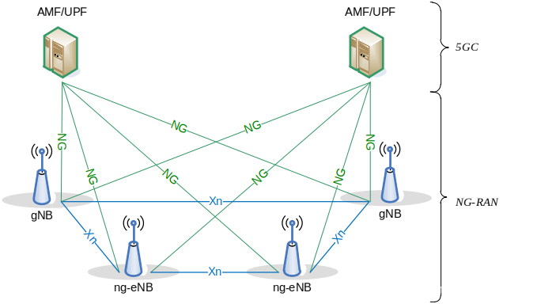
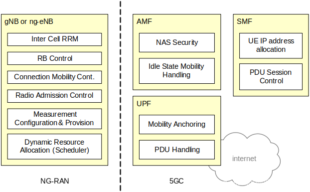
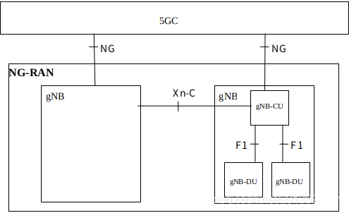

# 5G接入网AN

[TOC]

原文：https://blog.csdn.net/u013597671/article/details/84351242

## 一、基本网络架构

### 1.1 整体架构

5G系统由AN和5GC组成（38.300）

AN又分为gNB和ng-eNB

### 1.2 网元功能（3gpp 38.300）

### 1.3 AN网络架构（38.401）

每个逻辑gNB 由一个gNB-CU和若干个gNB-DU组成。

每个gNB-CU和gNB-DU通过F1逻辑接口连接。

一般来说一个gNB-DU只连接一个gNB-CU。（但是为了实现的灵活性，每个gNB-DU也可能连接到多个gNB-CU）

一个gNB CU中的控制面（CP）和用户面（UP）是分离。一般只有一个CP，但是允许有多个UP。要注意的是，gNB-CU及连接的若干gNB-DU**作为一个整体**逻辑gNB对外呈现的，**只对其他的gNB和所相连的5GC可见**。

## 1 gNB

 为UE提供NR用户面和控制面协议终结点

## 2 ng-eNB

为UE提供E-UTRA的用户面和控制面协议的终结点