# 环境配置

[TOC]

## 1. mmdetection3d

目标版本：0.17.1

### 1.1 前置准备

+ python 3.6+

  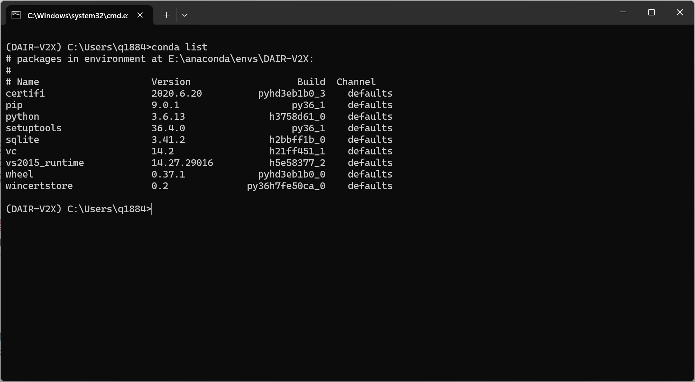

+ pytorch 1.3+

  按照文档要求安装pytorch1.4（CUDA9.2版本）

  ```shell
  # CUDA 9.2
  conda install pytorch==1.4.0 torchvision==0.5.0 cudatoolkit=9.2 -c pytorch
  ```

  显示找不到对应版本，conda安装失败

  ```shell
  # CUDA 9.2
  pip install torch==1.4.0+cu92 torchvision==0.5.0+cu92 -f https://download.pytorch.org/whl/torch_stable.html
  ```

  pip安装成功

  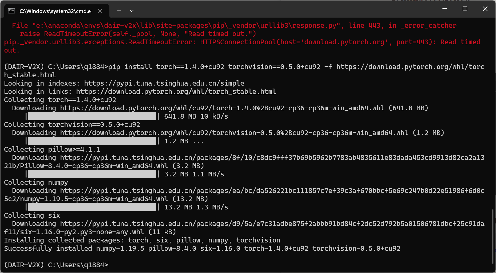

  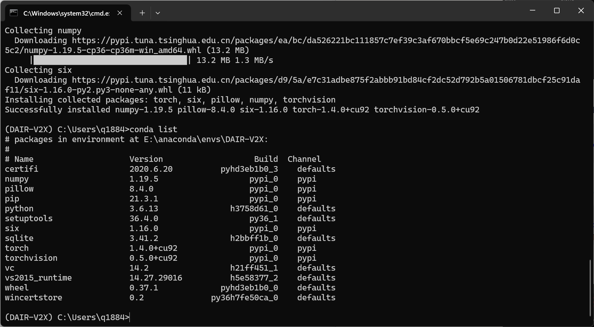

+ CUDA 9.2+

  ##### (1) 首先查看当前cuda版本

  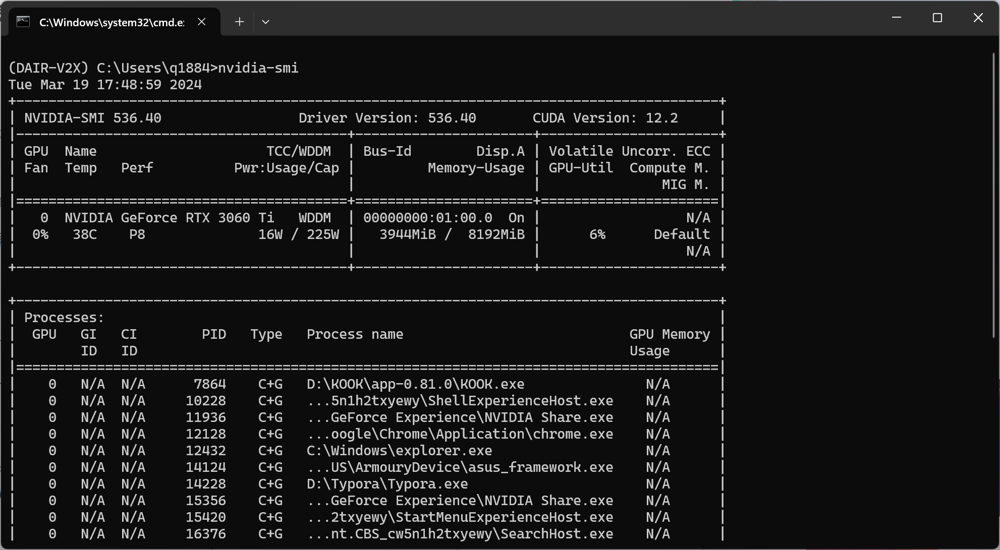

  ##### (2) 安装cudatoolkit9.2

  ```shell
  conda install cudatoolkit=10.1
  ```
  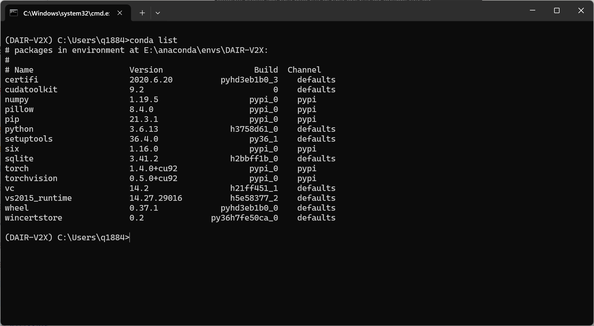

  ##### (3) 安装cudnn

  会自动匹配cuda版本

  ```shell
  conda install cudatoolkit=10.1
  ```

  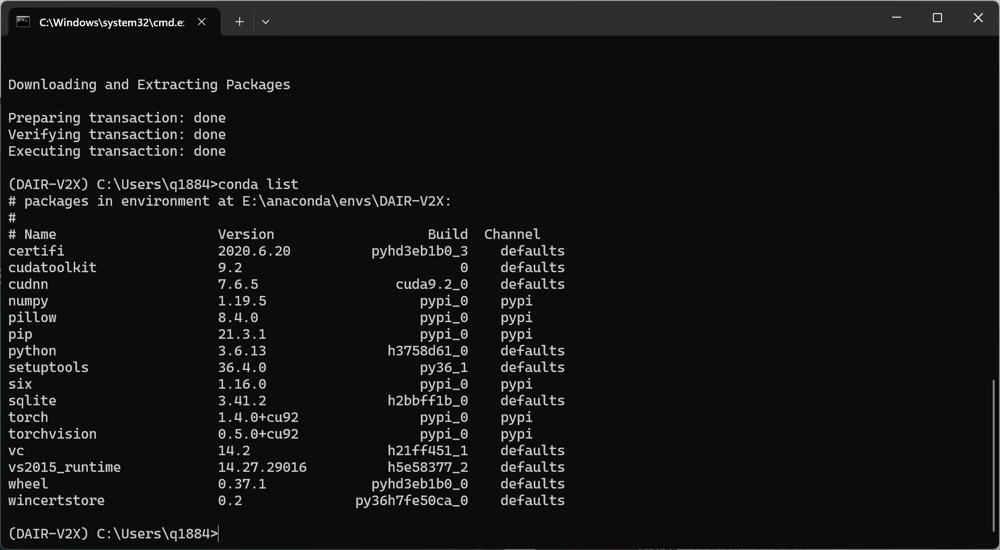

  成功安装cudnn 7.6.5

+ GCC 5+

  ##### (1) 安装mingw

  在https://sourceforge.net/projects/mingw/files/下载mingw安装包并安装

  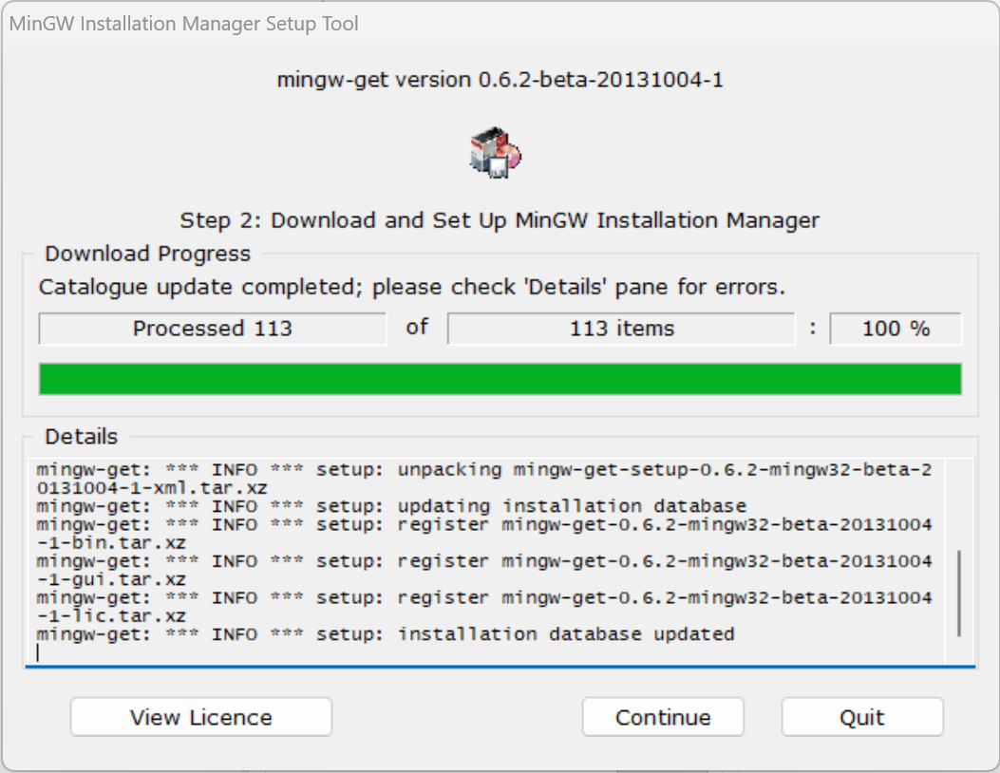

  ##### (2) 安装gcc

  ```shell
  mingw-get install gcc
  ```

  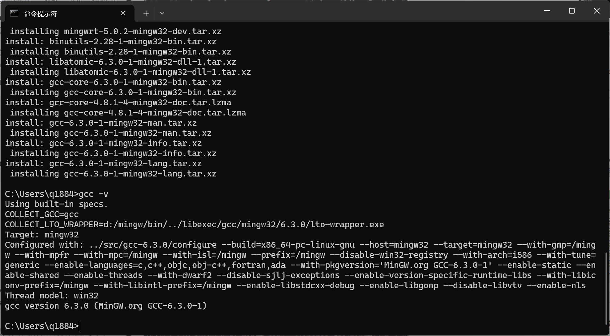

### 1.2 安装mmcv

#### 1.2.1 安装openmim

```shell
pip install openmim
```

在安装`pycryptodome`时屡次报错，独立安装`pycryptodome`仍然报错

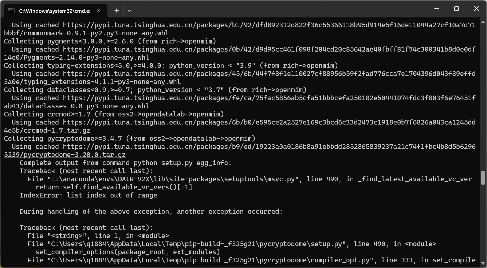

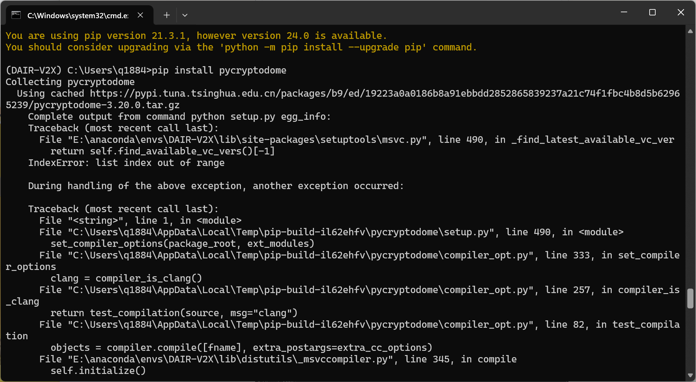

后使用conda安装，发现应先安装certifi库

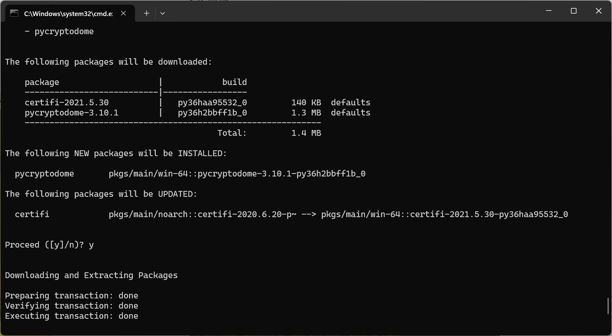

pip安装cryptography库时出错

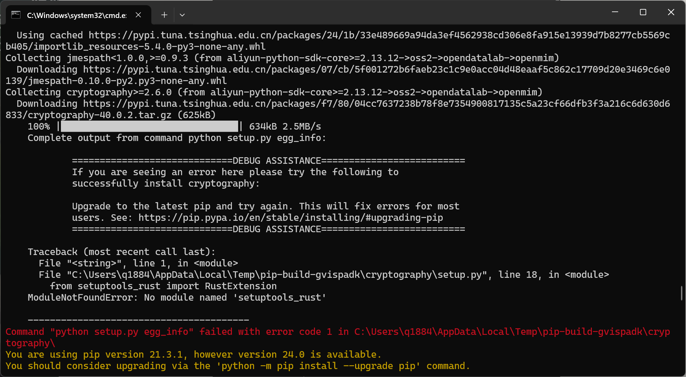

改用conda安装，发现应先安装若干库

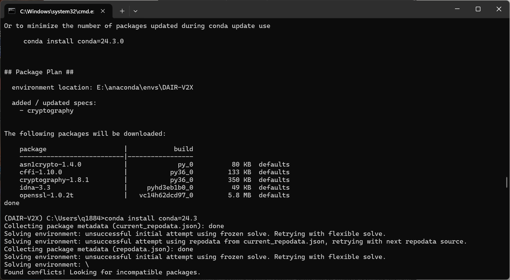

默认安装的cryptography只有1.8.1版本，而openmim需要>=2.6.0版本

安装2.6.1版本的cryptography

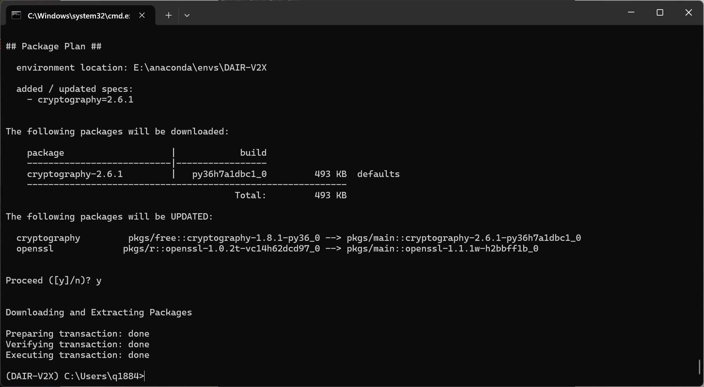

安装openmim成功


#### 1.2.2