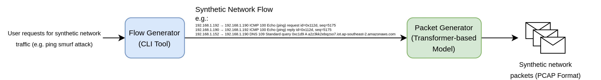
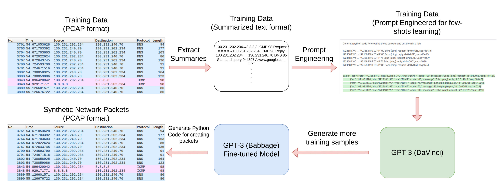
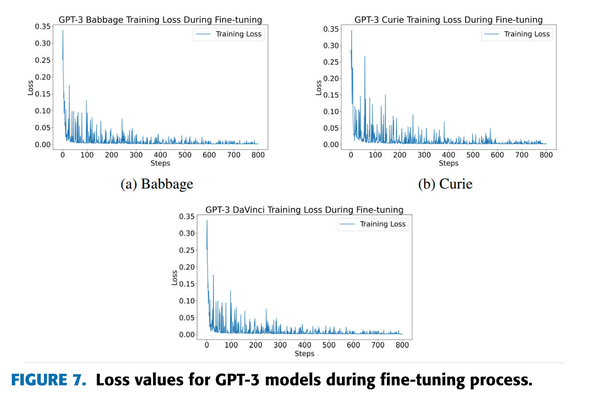
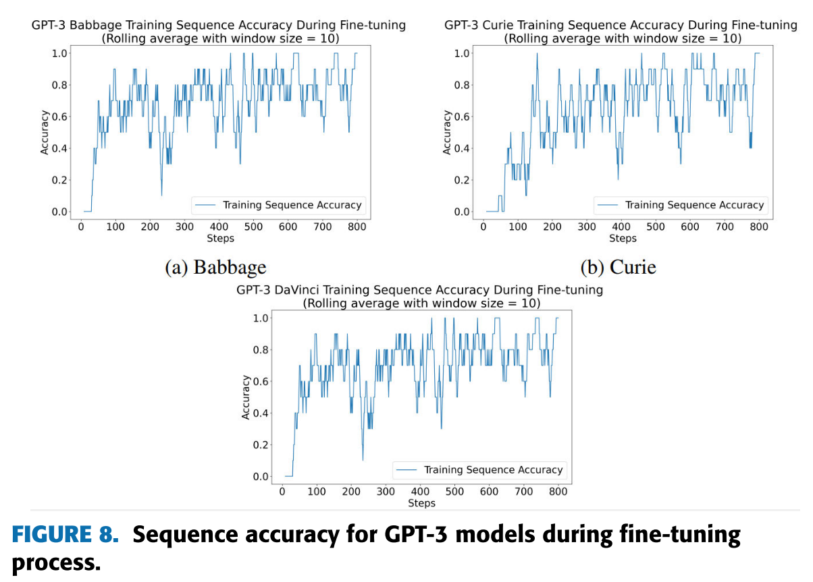
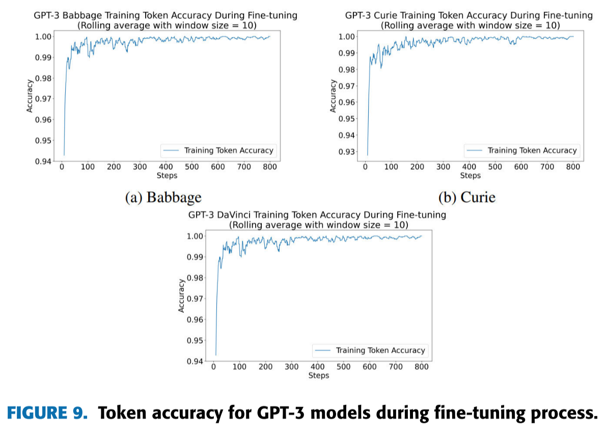
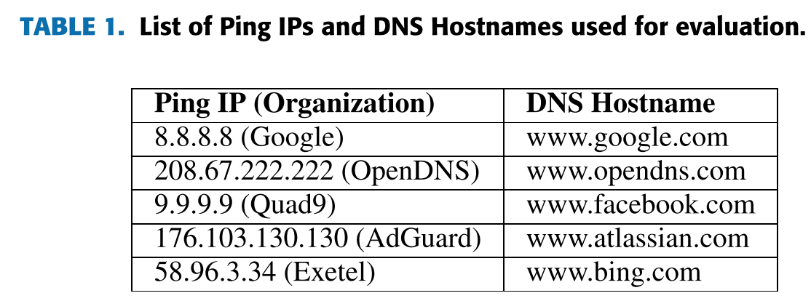
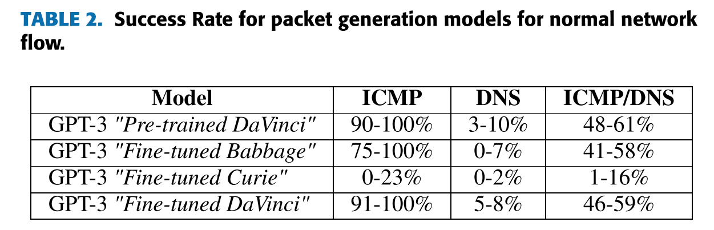
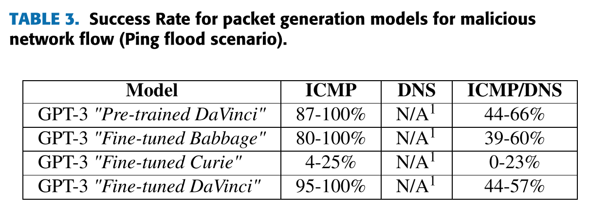

# PAC-GPT: A Novel Approach to Generating Synthetic Network Traffic With GPT-3

**PAC-GPT：一种利用GPT-3生成合成网络流量的新方法**

来源：IEEE Access

组织：Center for Ubiquitous Computing, University of Oulu

作者：[Danial Khosh Kholgh](https://ieeexplore.ieee.org/author/750534901584684), [Panos Kostakos](https://ieeexplore.ieee.org/author/37086302794)

简评：

本文基于GPT-3，构建了数据包生成器和流量生成器，在ICMP和DNS协议上进行了数据包生成和流量生成，并设计了一套基于Python脚本的命令行工具，最后基于内在指标（常见的模型评价指标，如损失函数、准确率等）和外在指标（应用于真实网络环境时收到正确回复的成功率）进行评估

研究背景：

+ 如今的计算机网络研究中需要大量可信的数据集
+ 现有数据集过时，采集真实网络数据侵犯隐私
+ 网络流量生成器如今已有三代（基于随机分布和用户自定义、基于机器学习和深度神经网络、基于GAN与Transformer）

研究动机：生成更有效的流量数据可以应用于IDS模型预训练

改进：

+ 对于成功率指标，所有模型都无法生成生成DNS包（说明无法应用于DNS协议的网络环境），需要改进

+ 基于GPT-3，可以采用更强的Transformer模型

+ 可以在更多更复杂的网络协议上使用该方法，如TCP/UDP

[TOC]

## 摘要

1. 现实数据集稀缺、过时、定性和定量方面存在不足
2. PAC-GPT，基于GPT3的框架，Flow Generator + Packet Generator
3. Flow Generator：捕获和重新生成一系列网络数据包中的模式
4. Packet Generator：在给定网络流的情况下生成单个网络数据包
5. 基于LLM链接的数据包生成器，并评估
6. 命令行界面工具

**结论：**Transformer架构是最适合用来在生成流量数据包时进行微调

## 引言

### （1）现有网络流量数据存在问题：

1. 目前可访问的大多数网络安全数据集都存在信息过时或数量和质量不足的问题，使得它们不足以满足机器学习要求

2. 来自真实的网络环境的高质量真实数据集包含个人和敏感数据，这可能会损害隐私，从而在获取适当的数据进行模型训练时为数据科学家带来障碍

   解决隐私问题：

   + 非加密匿名化
   + 加密匿名化
   + 差分隐私

### （2）目标

1. 基于该团队之前的GAN、Transformer研究成果
2. 使用LLM生成与真实的数据非常相似的合成网络流量
3. 用于训练IDS

### （3）工作

1. 数据包生成器：按需生成数据包

2. 流生成器：

   使用了一组Python脚本来建立一个能够将一系列自定义数据包注入网络的“流生成器”

3. 建立CLI工具，无缝管理数据生成管道

4. 对这种合成替代品在各种网络安全任务中的可行性进行调查，评估这种方法是否可以有效地替代真实的数据

### （4）总结

回答了三个问题：

1. Transformers在执行生成不同类型的网络数据包的任务时表现如何？

2. 在考虑各种威胁建模时，生成网络数据包的工具有多大用处？

3. 合成网络流量生成对行业有何影响？

## 相关工作

### （1）流量生成器的历史

1. 第一代：

   + 用户自定义或随机（报头信息和有效载荷），无需实际的网络流量
   + D-ITG，PackETH，Ostinato，Iperf，Netperf,，IP Traffic
   + Adeleke提出的六大分类：
     + 恒定或最大吞吐量生成器：以恒定速率或最大可能速率发送数据包（iperf2、netperf）
     + 应用程序级生成器
     + 跟踪文件重放工具
     + 基于模型的流量生成器：流量遵循随机分布
     + 跟踪驱动的基于模型的流量生成器：使用来自实际生产网络的跟踪文件输入或日志文件作为源
     + 基于脚本的流量生成器：用户能够创建具有可自定义头值的任何数据包类型，并能够在运行时修改数据包

2. 第二代（使用ML）：

   贝叶斯方法、改进的关联算法、支持向量机、维恩概率机、k-最近邻和k-均值聚类算法，深度神经网络，来生成类概率分布

   用来测试ML模型的常用数据集：

   + DARPA
   + KDD’99
   + TON_IoT

3. 第三代（合成流量生成器）：

   + GAN

     1. PAC-GAN: Packet generation of network traffic using
        generative adversarial networks

        提出了一种使用GAN在IP分组层创建真实网络流量数据的方法

     2. 本文提出了一种将网络流量数据编码到卷积神经网络（CNN）GAN模型中的替代方法

     3. PcapGAN: Packet capture file generator
        by style-based generative adversarial networks

        引入了“style "的概念作为向量值，以有效地表达主机到主机的关系，例如C&C服务器僵尸网络连接

     4. [A review of tabular data synthesis using GANs on an IDS dataset](https://www.mdpi.com/2078-2489/12/9/375)

        讨论了GAN在生成用于网络安全的合成IDS数据中的使用，重点介绍了流行的GAN架构，VanillaGAN，CTGAN，CopulaGAN和TableGAN等表格数据（以表格或电子表格形式组织的数据，行表示单个记录，列表示特征或属性）生成模型。

   + Transformer

     Transformers已迅速成为各种NLP任务的事实标准，包括机器翻译，情感分析，文本摘要和问答系统

     1. [Generative transformer
       framework for network traffic generation and classification](https://cyberleninka.ru/article/n/generative-transformer-framework-for-network-traffic-generation-and-classification)

       + 使用数据包大小和数据包间时间序列作为流特征来简化输入，并可以通过两种方式进行训练：用于生成网络流量和作为网络流分类器
   
       + 基于GPT-2
   

### （2）分析合成网络流量数据

1. Emmerich 等人（2019）

   评估数据包生成器的速率控制能力，包括以下三个标准：

   1. **带宽**：生成过程中的最大传输容量（每秒包数）。
   2. **准确性**：系统误差，评估观察到的平均速率与设定速率的接近程度。
   3. **精度**：随机误差，评估单个包间隔的偏差。

2. Molnár 等人（2017）

   提出了验证网络流量源的测量分类系统：

   1. **数据包级别指标**：评估单个数据包特性，如大小、到达时间和丢包率。
   2. **流级别指标**：评估流特性，如流大小、持续时间和到达时间。
   3. **扩展特性**：评估生成器在流数量、数据包数量或生成速率方面的扩展能力。
   4. **QoS/QoE 相关指标**：评估服务质量（QoS）或体验质量（QoE），如包延迟、抖动和吞吐量。

3. Ring 等人（2019）

   使用以下方法评估生成数据集的质量：

   1. 可视化生成数据和真实数据的属性并进行比较。
   2. 计算生成数据和真实数据之间的欧几里得距离。
   3. 设计基于领域知识的检查，通过自动化测试评估数据内容和属性关系。

4. Cheng（2019）

   引入了以下两种新指标：

   1. **成功率**：生成器成功发送的数据包数与总生成数据包数的比率。
   2. **字节错误**：比较生成的数据包与正确形成的数据包的平均字节错误数。

## 方法论

### （1）网络流量生成器

#### 网络流量生成框架

1. **用户请求网络流量**：可以是特定场景（如正常流量数据或Ping-of-Death攻击）或指定网络协议（如ICMP、DNS等）。
2. **流生成器**：通过Python脚本和命令行界面生成网络流量的文本格式序列和摘要，而不是实际的数据包。
3. **数据包生成器**：使用基于Transformer的模型，根据网络流生成实际数据包，并将它们以PCAP格式写入文件。

#### PAC-GPT

1. **文本表示转换**：使用`tcpdump`提取数据包摘要，并进行预处理和清理，最终输出如图3所示。示例数据包来自ToN IoT数据集，共包含10000个ICMP和DNS数据包。
2. **初步生成Python代码**：将提取的摘要输入GPT-3 "DaVinci"模型，通过提示工程生成对应的Python代码，形成800个训练样本。
3. **微调较小模型**：使用生成的训练样本微调较小且高效的GPT-3 "Babbage"模型，提高数据包生成的效率和成本效益。
4. **实际数据包生成**：通过执行微调后的Babbage模型生成的代码，使用Python和Scapy创建和处理具体的数据包。

"DaVinci"模型用于生成初始代码，"Babbage"模型则经过微调用于高效生成数据包。

最终生成的数据包通过Scapy处理，并保存为PCAP格式文件。

### （2）模型评估指标

#### 内在指标（Intrinsic Metrics）

1. **训练损失（Training Loss）**：评估模型在训练过程中损失函数的值，以衡量模型的收敛情况。
2. **训练序列准确率（Training Sequence Accuracy）**：评估生成序列的准确率。
3. **训练Token准确率（Training Token Accuracy）**：评估生成单个Token的准确率。

#### 外在指标（Extrinsic Metrics）

1. **成功率（Success Rate）**：将生成的数据包在实际网络中进行回放，观察数据包传输的成功率。成功的数据包是指那些能收到正确回复的数据包，例如ping请求收到的回复或者DNS查询的主机名解析。

通过内在指标，我们可以了解模型在训练过程中的表现，

通过外在指标，我们可以评估生成的数据包在真实网络环境中的质量和有效性。

### （3）命令行工具

#### 生成流程概述
网络流由一系列组成网络流量的数据包构成。为了生成这些数据包，需要实现一个Python脚本作为命令行工具（CLI），生成网络流并调用数据包生成模型。该脚本功能如下：
- **生成网络流**：按特定协议和场景生成数据包。
- **调用数据包生成器**：生成实际数据包。
- **写入PCAP文件**：保存生成的数据包。
- **网络重放**：选择性地在网络接口上传输生成的数据包。

#### CLI工具选项
1. **ip_file**：指定IP配置文件路径，设定包发送者和接收者的IP地址。
2. **output_file**：指定输出PCAP文件路径。
3. **n**：生成数据包的数量。
4. **protocols**：指定生成数据包的网络协议。
5. **scenario**：生成数据包的场景，包括正常流量、Ping of Death攻击、Ping洪泛攻击、Ping Smurf攻击、DNS洪泛攻击等。
6. **replay_packets**：是否在网络上重放生成的数据包。

#### 场景定义
1. **Normal**：生成正常的网络流量，无特定攻击。
2. **Ping of Death Attack**：生成超大ICMP数据包，模拟DoS攻击。
3. **Ping Flood**：生成大量ICMP Echo请求包，攻击目标设备。
4. **Ping Smurf**：使用伪造源IP的ICMP Echo请求包，通过广播地址攻击目标。
5. **DNS Flood**：发送大量DNS请求，耗尽DNS服务器资源。

该工具通过以上选项和场景实现灵活的数据包生成和流量模拟，提供用于网络安全研究和测试的合成流量数据。

## 结果

### （1）内在指标

#### 损失函数值
损失函数值用于优化模型，也可作为评估模型训练进展的指标。损失函数值越低，模型性能越好。

#### 训练序列准确率
训练序列准确率是指模型在训练批次中，预测序列与真实序列完全匹配的百分比。例如，如果批次大小为3，实际序列为([1, 2], [0, 5], [4, 2])，模型预测为([1, 1], [0, 5], [4, 2])，则准确率为2/3，即0.67。

#### 训练token准确率
训练token准确率是指训练批次中，模型正确预测的token的百分比。例如，批次大小为3，实际序列为([1, 2], [0, 5], [4, 2])，模型预测为([1, 1], [0, 5], [4, 2])，准确率为5/6，即0.83。

使用OpenAI API对GPT-3的三个变种模型（DaVinci、Curie和Babbage）进行了微调。

损失函数值，训练序列准确率和训练token准确率如图所示：

### （2）外在指标

外在指标即成功率

基于三种网络数据包类型对模型进行了训练：

+ ICMP数据包（ping请求和回复）
+ DNS数据包（DNS查询请求和响应）
+ ICMP/DNS组合数据包

为有效测试数据包生成模型的能力，**模型生成了发送到和接收自一组公共IP和主机名的数据包**（分别针对ICMP和DNS数据包）。这些IP和主机名如表1所示。

表2报告了在生成**正常流量**时，各模型在每个数据集上的成功率指标。较低值为五次尝试中的最小值，较高值为最大值。

表3报告了在生成**恶意流量**场景（如ping洪泛攻击）时的成功率指标。

## 讨论

### （1）解释结果

#### 训练过程评估

**内在指标：**

1. **损失函数值：** 模型的训练损失在训练过程中逐渐趋于稳定，但Curie的初始学习曲线相对较浅。
2. **训练序列准确率：** Curie的训练进展相对较慢，而DaVinci略微优于其他模型）。
3. **训练标记准确率：** DaVinci在标记准确率上表现最佳，Curie较Babbage易于微调。

虽然Curie理论上比Babbage更强大，但Curie在某些实例中表现劣于Babbage。

**外在指标：**

1. **成功率：** 对于ICMP包生成，Babbage和DaVinci（微调后）表现良好，有时生成的数据包完全可传输且接收响应。即使不经过微调，预训练的DaVinci也能生成高质量的数据包，但每个数据包的成本稍高（见表2和表3）。
2. **DNS包生成:** 所有模型在生成DNS包时表现不佳，预训练的DaVinci的成功率最高但也仅为10%。

这种低性能与Scapy处理DNS包的复杂性有关，因为DNS协议比ICMP复杂。

**综合协议生成:** 当生成包含ICMP和DNS包的数据集时，模型表现稍好，约一半的数据包获得响应，但这可能是因为模型在生成ICMP包方面更熟练。

### （2）应用

#### 工具在网络安全中的作用

**合成流量生成:**
1. **测试和评估:**
   - **入侵检测系统（IDS）:** 红队可以使用该工具生成数据包，评估 IDS 在各种流量条件下的表现。
   - **网络性能测试:** 该工具可以生成数据包用于性能测试，例如吞吐量、延迟和数据包丢失分析。
   
2. **定制安全措施:**
   - **基于机器学习的 IDS/IPS:** 安全架构师可以生成大量数据集用于训练 ML 基于 IDS/IPS。工具提供的恶意场景对这类训练尤为有用，确保训练数据中有正常和恶意流量的平衡。

**NIST 威胁框架:**

- **检测层:** 该工具有助于检测网络异常，适合训练 IDS 监控和识别恶意活动。
- **保护层:** 该工具可以帮助训练 IPS 主动防止威胁，通过检测和减轻恶意活动来保护系统。

**培训和教育:**
- **安全人员培训:** 该工具提供了一个无风险环境，让安全专业人员在分析网络流量和响应安全事件方面获得实践经验，减少生产环境中断和数据泄露的风险。

#### 潜在误用及缓解

**误用案例:**
1. **网络过载:** 恶意用户可能生成过多流量，导致网络瓶颈和中断。
2. **逆向工程 IDS/IPS:** 攻击者可能使用合成数据开发自己的 ML 基于 IDS/IPS 以找到漏洞并绕过生产系统。

**缓解策略:**
- **访问控制:** 实施严格的访问控制和监控，以防止未经授权使用该工具。
- **异常检测:** 采用强大的异常检测机制，识别和缓解由潜在误用产生的异常流量模式。

### （3）限制

**协议选择的局限性**：论文只考虑了ICMP和DNS两个基本网络协议。

**训练数据和训练时间的限制**：所使用的GPT-3模型仅用200对提示-完成对进行训练，这接近OpenAI建议的最小训练样本量。

**场景定义的约束**：当前仅定义了有限的场景来展示流量生成器的潜在用例，并未涵盖所有可能的恶意网络场景。

**评估方法的问题**：用于评估模型和工具性能的多种方法和指标存在争议，目前学术界尚未达成一致。

**实验再现性的问题**：由于大语言模型的复杂性和文本生成过程中的随机性，准确再现实验结果可能非常困难。

## 总结

这项研究提出并实现了一个端到端的网络流量生成框架，主要包括以下几点：

1. **模型评估**：训练和测试了基于变换器的模型，发现其在生成简单的ICMP协议包时表现良好，但在生成复杂的DNS协议包时存在困难。

2. **框架构建**：提出了一个包含数据包生成器和流量生成器的框架，便于单独改进和交换这两个组件。

3. **CLI工具开发**：实现了一个基于Python CLI工具，用于流量生成，并包括了多种恶意场景的选项。

后续工作：

**扩展协议支持**

**丰富场景**

**智能化流量生成**：现有CLI工具使用静态脚本生成数据包摘要。可以通过引入更智能、动态的流量生成器（如基于最新文本生成技术的Transformer模型），来生成更接近真实网络数据的流量。

**改进评估方法**