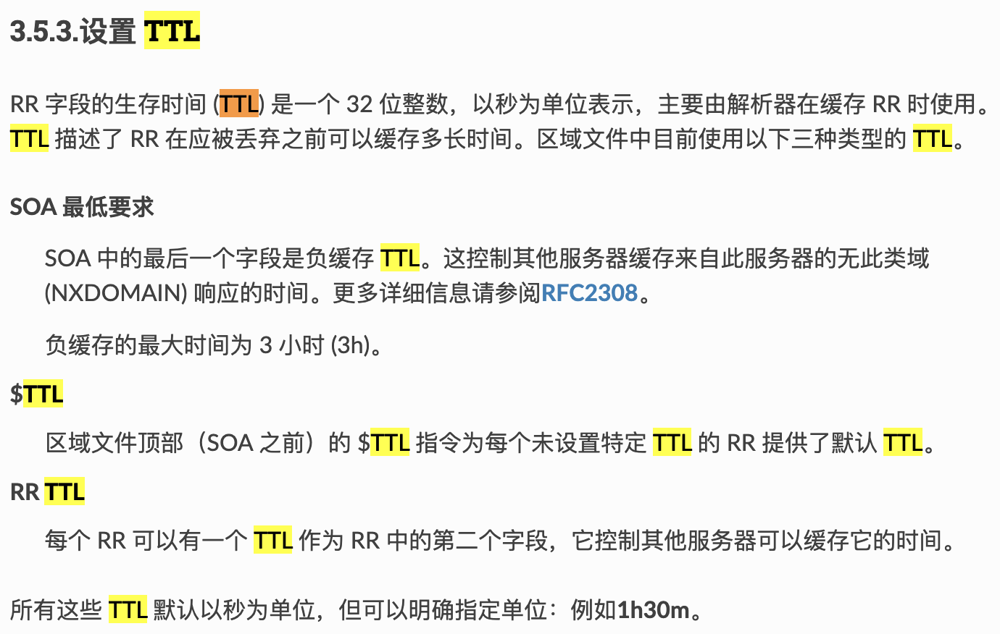

# 2024.10.16

## 1. QNAME Minimisation

### RFC文档中关于QMIN的规定

[RFC 9156](https://datatracker.ietf.org/doc/rfc9156/)

提高 DNS 的私密性，即 DNS 解析器不再总是向上游名称服务器发送完整的原始 QNAME 和原始 QTYPE

> This document describes a technique called "QNAME minimisation" to
>    improve DNS privacy, where the DNS resolver no longer always sends
>    the full original QNAME and original QTYPE to the upstream name
>    server.  This document obsoletes RFC 7816.

RFC7816->RFC9156

### 复现QMIN过程中需多次dig原因分析

举例：6.5.4.3.2.1.a.com

1. Bind9以及其他DNS解析器中对于QMIN的最大深度作出了限制

   https://www.isc.org/blogs/qname-minimization-and-privacy/

   > In the case of zones that contain labels that are multiple levels deep (reverse PTR lookups for IPv6 is the classic example), QNAME minimization can require more queries than previously necessary. There are limits on how deep BIND will go with qname-minimization, and BIND will “jump over” some labels when querying for IPv6 PTR records. This difference will diminish as the cache is primed with answers.

2. 在[Mitigating QNAME minimization performance problems](https://www.ietf.org/id/draft-levine-qmin-performance-01.html)一文中，作者提到Google 的 DNS 在两个标签后就停止截断，因为这样可以在不增加负载的情况下获得完全最小化的大部分好处：

   > ### [3.3. ](https://www.ietf.org/id/draft-levine-qmin-performance-01.html#section-3.3)[Stop at two or three](https://www.ietf.org/id/draft-levine-qmin-performance-01.html#name-stop-at-two-or-three)
   >
   > In [[secondlook](https://www.ietf.org/id/draft-levine-qmin-performance-01.html#secondlook)] the authors found that Google's DNS stopped truncating after two labels, since this got most of the benefit of full minimization with no increase in the load. They discovered this by accident when doing minimization tests on four label names, and Google appeared to their test not to minimize.
   >
   > Most top-level domains have registered names at the second level, and nearly all at the second or third level. so stopping after three labels would likely get nearly all of the benefit at very low cost.

   这也与我们的实验结果相符：

   在对2.1.a.com的解析后，解析器就直接跳到了6.5.4.3.2.1.a.com，导致解析失败

   （此处应有抓包图）

3. 这种现象在[A Second Look at DNS QNAME Minimization](https://link.springer.com/chapter/10.1007/978-3-031-28486-1_21)一文中也有提及

   > The client-side active measurements at DNSThought are measuring qmin at the fourth-level domain. This means that the number of resolvers minimizing queries at lower levels (e.g., TLD and root) could be even higher.

4. 

## 2. TTL字段

### RFC文档中关于TTL的规定

[RFC 1035](https://datatracker.ietf.org/doc/rfc1035/)：

+ TTL是一个32bit的正值

+ TTL用于指出再次查询信息源之前缓存资源记录的时间间隔

+ 0表示资源记录只能用于进行中的事务，而不能缓存

+ **SOA记录总以0TTL发布，以禁止缓存**

  > For example, SOA records are always distributed with a zero TTL to prohibit caching.

  > $TTL 86400          ; 默认TTL为24小时
  > @   IN  SOA ns1.example.com. admin.example.com. (
  >         2024010101 ; serial number
  >         3600       ; refresh (1 hour)
  >         1800       ; retry (30 minutes)
  >         604800     ; expire (1 week)
  >         86400      ; minimum (1 day)
  > )
  >
  > ; SOA记录TTL为0，禁止缓存
  > @   IN  SOA ns1.example.com. admin.example.com.  (
  >         2024010101 ; serial number
  >         3600       ; refresh (1 hour)
  >         1800       ; retry (30 minutes)
  >         604800     ; expire (1 week)
  >         86400      ; minimum (1 day)
  > ) 0
  >
  > ; A记录示例
  > www IN A 192.0.2.1

+ SOA中的MINIMUM字段规定了区域中所有TTL的下限

### TTL过期

+ 解析器标记DNS为过期状态，并认为缓存中的数据无效，当收到对应的域的请求时，会重新发起查询请求

+ 正常情况下，权威服务器中的zone文件不会过期，TTL字段只是告知解析器进行缓存的时间（因此解析器中的zone记录没有TTL字段）

  + 异常情况：

    + 配置错误
    + 软件故障

    返回SERVFAIL错误，并记录日志

  + TTL=0，会导致出现大量DNS流量
  
+ 在查询到新的zone信息后，解析器会更新缓存的持续时间

## 3. 负缓存 Negative Cache

[RFC 8020](https://datatracker.ietf.org/doc/rfc8020/)

+ 解析器在接收到NXDOMAIN响应时会将响应储存在cache中
+ 该节点及其下的所有名称和资源记录集都应被视为不可达
+ 对这些名称的后续查询应直接返回NXDOMAIN响应
+ NXDOMAIN被储存的时间被记录为**negative TTL**

## 4. SOA编写相关

1. Serial Number：
   + [What is a DNS SOA record?](https://www.cloudflare.com/learning/dns/dns-records/dns-soa-record/)一文指出，序列号是SOA序列的版本号
   + 区域文件中的序列号发生变化时，二级名称服务器（从服务器）就会收到提醒，他们应该通过区域转移更新自己的区域文件副本
