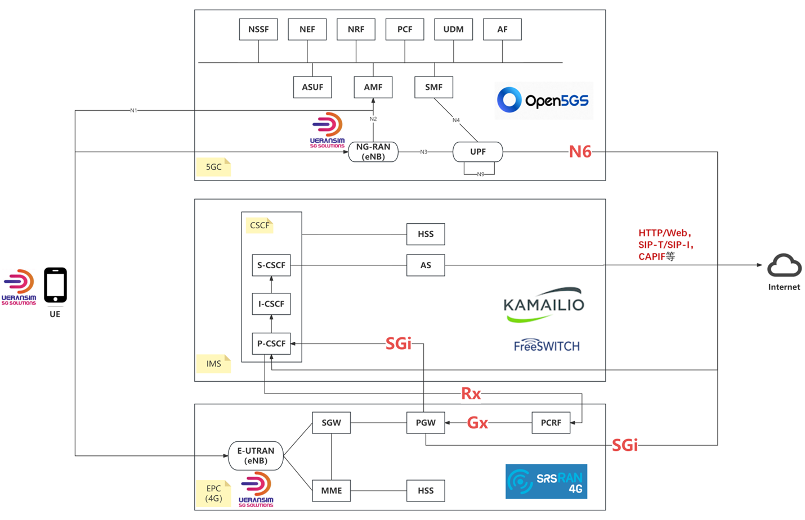
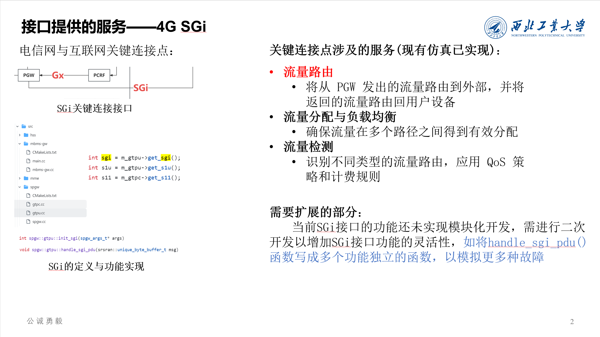
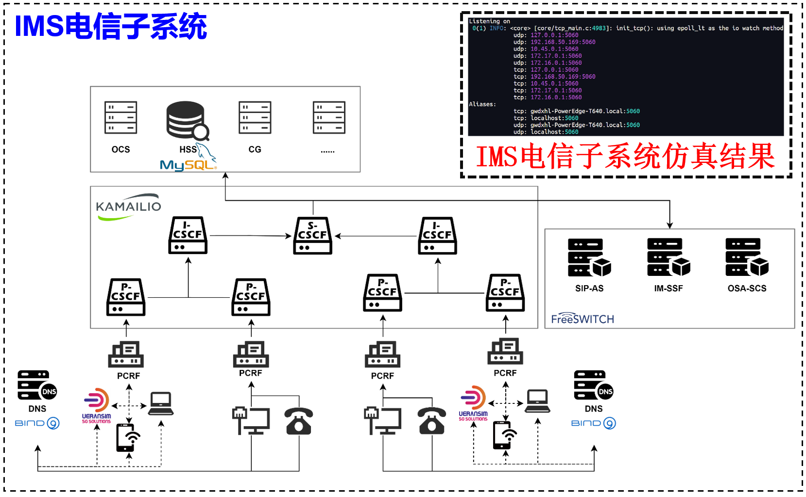
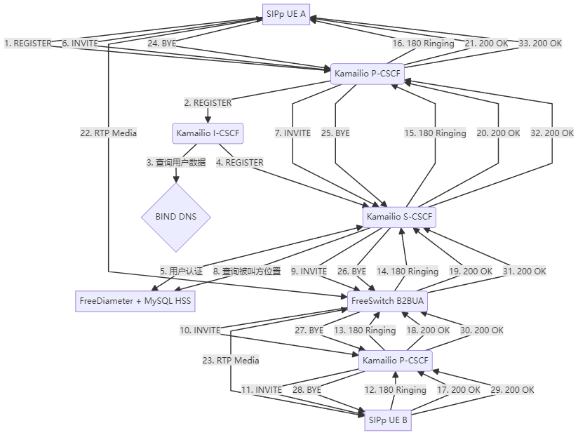
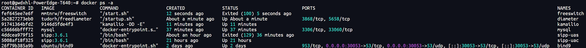
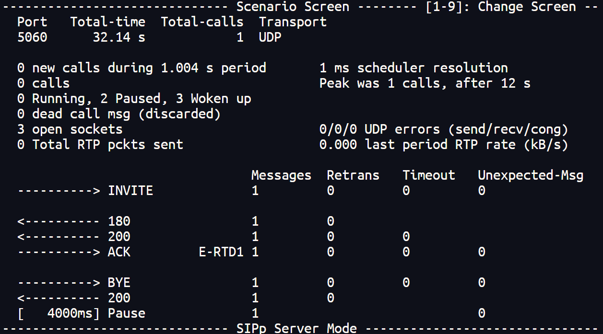
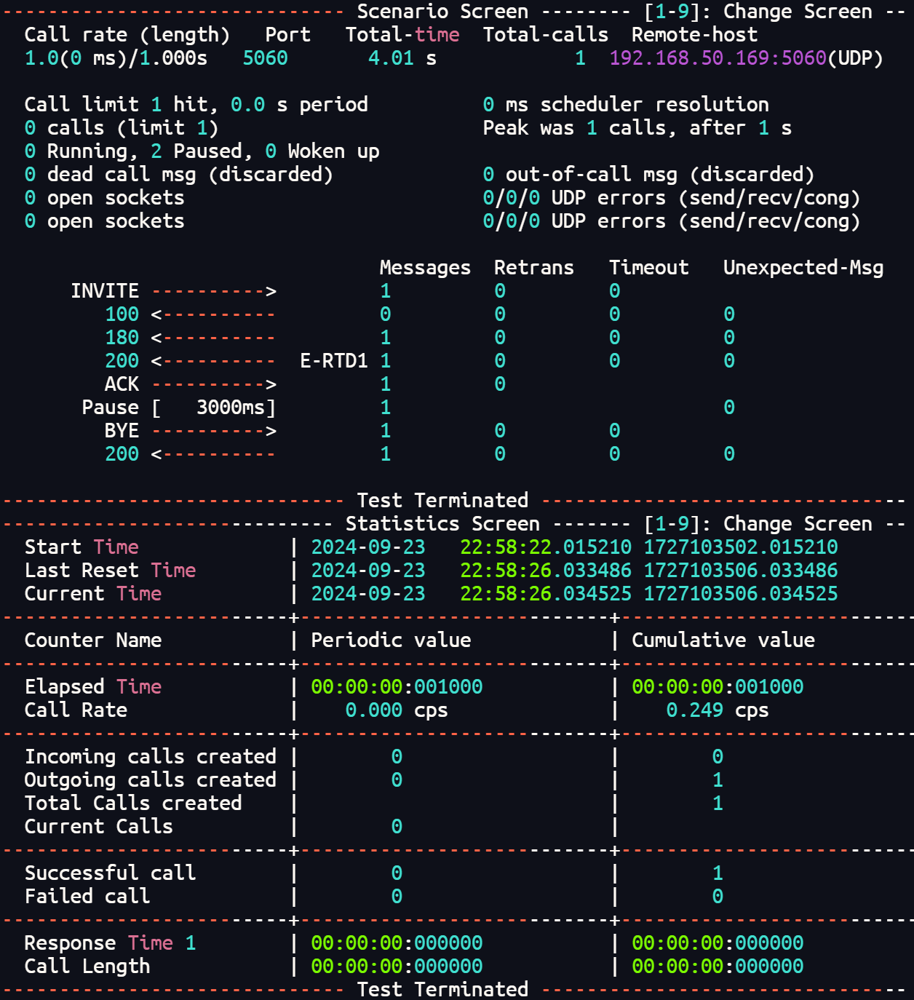
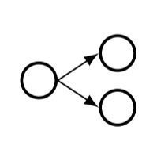
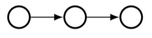

# 2024 9.10-9.24周报

by M2 罗忠南

[TOC]

## 一、背景知识学习

### 1. 电信网整体框架梳理






+ 总结归纳了4G EPC，5G，IMS主体框架与核心网元，绘制了架构图
+ 重点探究三种典型网络之间进行通讯和电信网与互联网之间通讯的接口与协议，初步阅读源码
  + 5GC与其他网络通信：UPF->N6->Internet
  + 4G EPC与其他网络通信：PGW->SGi->Internet
  + IMS与4G EPC通信（进行计费和流量控制等服务）：P-CSCF->Rx->PCRF->Gx->PGW
  + IMS通过多种AS（Application Server），使用多种协议（如SIP和HTTP）与Internet通信
+ 初步确立了每种电信网使用的仿真模拟平台，并对这些软件的使用进行了了解
  + UE：UERANSIM
  + 4G：SRSRAN 4G（或Open5GS）
  + 5G：Open5GS
  + IMS：Kamilio+FreeSwitch
  + Internet：GNS3等

### 2. IMS网络框架梳理



+ 重点探究IMS网络的架构与核心网元，了解每个网元的功能，绘制架构图
  + CSCF
    + P-CSCF
    + I-CSCF
    + S-CSCF
  + MGCF
  + PCRF
  + AS
  + HSS
+ 确立主要网元使用的仿真平台
  + IMS核心（CSCF），SIP信令代理服务器：Kamailio
  + AS：FreeSwitch实现B2BUA
    + B2BUA作为一个逻辑实体，主要负责接收用户的SIP请求并向用户代理客户端生成新请求
    + 与Kamailio实现的SIP代理服务器相区别，Kamailio负责对SIP消息的转发和路由，FreeSwitch负责对SIP进行更细节和深入的修改
  + DNS：Bind9
    + 提供DNS服务，如客户端寻找PCRF，PCRF等CSCF等场景
  + HSS：MySQL
    + 负责储存用户注册信息与证书
  + Diameter：FreeDiameter
    + 负责IMS网络中证书的下发
  + UA；SIPp与pysipp
    + pysipp能通过编写python脚本的方式发送和接收sipp消息
    + 在大规模仿真和高度自定义SIP消息的场景下具有更大优势

### 3. SIP协议通话过程梳理



+ 用户首先向CSCF发起注册和认证，才能进行后续的通讯
+ 在进行通话时，发送方UAC向接收方UAS发送INVITE消息，消息经由CSCF转发
+ 对于UAS收到的信息，需要对其发送OK消息确认
+ 与HTTP协议类似，SIP协议中也有很多状态码，例如：
  + 1xx：临时响应
  + 2xx：成功响应
  + 3xx：重定向响应
  + 4xx：客户端错误
  + 5xx：服务器错误
  + 6xx：全局错误
+ 与其他网络报文类似，SIP消息结构如下:
  + 起始行：请求行或状态行
  + 消息头：包含各种头部字段
  + 空行
  + 消息体：通常使用SDP描述媒体信息
+ 其中重要的头部字段：
  + To：目标地址，From：源地址，Via：记录请求路径
  + Contact：直接可达的联系地址
  + Call-ID：唯一标识一个呼叫
  + CSeq：序列号，用于匹配请求和响应

## 二、原理样机搭建

### 1. IMS网络主要网元部署



+ 基于docker成功安装并启动了相关容器，对每个容器内部的文件结构进行了了解
+ dockerhub已有的SIPp镜像无法满足需求，于是基于Ubuntu安装了SIPp并保存为镜像
+ 后续可以利用pysipp取代SIPp容器，以满足大规模和高度自定义的仿真

### 2. 网元之间的打通





+ 将一个SIPp镜像作为UAC，另一个作为UAS，通过Kamailio成功路由了SIP消息，编写INVITE消息和REGISTRY消息的XML文件

  ```xml
  <?xml version="1.0" encoding="ISO-8859-1" ?>
     <scenario name="UAC">
       <send retrans="500">
         <![CDATA[
           INVITE sip:[service]@[remote_ip]:[remote_port] SIP/2.0
           Via: SIP/2.0/[transport] [local_ip]:[local_port];branch=[branch]
           From: sipp <sip:sipp@[local_ip]:[local_port]>;tag=[call_number]
           To: sut <sip:[service]@[remote_ip]:[remote_port]>
           Call-ID: [call_id]
           CSeq: 1 INVITE
           Contact: sip:sipp@[local_ip]:[local_port]
           Max-Forwards: 70
           Subject: Performance Test
           Content-Type: application/sdp
           Content-Length: [len]
     
           v=0
           o=user1 53655765 2353687637 IN IP[local_ip_type] [local_ip]
           s=-
           c=IN IP[media_ip_type] [media_ip]
           t=0 0
           m=audio [media_port] RTP/AVP 0
           a=rtpmap:0 PCMU/8000
         ]]>
       </send>
     
       <recv response="100" optional="true">
       </recv>
     
       <recv response="180" optional="true">
       </recv>
     
       <recv response="200" rtd="true">
       </recv>
     
       <send>
         <![CDATA[
           ACK sip:[service]@[remote_ip]:[remote_port] SIP/2.0
           Via: SIP/2.0/[transport] [local_ip]:[local_port];branch=[branch]
           From: sipp <sip:sipp@[local_ip]:[local_port]>;tag=[call_number]
           To: sut <sip:[service]@[remote_ip]:[remote_port]>[remote_tag_param]
           Call-ID: [call_id]
           CSeq: 1 ACK
           Contact: sip:sipp@[local_ip]:[local_port]
           Max-Forwards: 70
           Subject: Performance Test
           Content-Length: 0
         ]]>
       </send>
     
       <pause milliseconds="3000"/>
     
       <send retrans="500">
         <![CDATA[
           BYE sip:[service]@[remote_ip]:[remote_port] SIP/2.0
           Via: SIP/2.0/[transport] [local_ip]:[local_port];branch=[branch]
           From: sipp <sip:sipp@[local_ip]:[local_port]>;tag=[call_number]
           To: sut <sip:[service]@[remote_ip]:[remote_port]>[remote_tag_param]
           Call-ID: [call_id]
           CSeq: 2 BYE
           Contact: sip:sipp@[local_ip]:[local_port]
           Max-Forwards: 70
           Subject: Performance Test
           Content-Length: 0
         ]]>
       </send>
     
       <recv response="200" crlf="true">
       </recv>
     
       <ResponseTimeRepartition value="10, 20, 30, 40, 50, 100, 150, 200"/>
       <CallLengthRepartition value="10, 50, 100, 500, 1000, 5000, 10000"/>
     
     </scenario>
  ```

  ```xml
  <?xml version="1.0" encoding="ISO-8859-1" ?>
     <scenario name="Register">
       <send retrans="500">
         <![CDATA[
           REGISTER sip:[remote_ip] SIP/2.0
           Via: SIP/2.0/[transport] [local_ip]:[local_port];branch=[branch]
           From: sipp <sip:sipp@[local_ip]:[local_port]>;tag=[call_number]
           To: sut <sip:service@[remote_ip]:[remote_port]>
           Call-ID: [call_id]
           CSeq: 1 REGISTER
           Contact: sip:sipp@[local_ip]:[local_port]
           Max-Forwards: 70
           Subject: Performance Test
           Content-Length: 0
         ]]>
       </send>
     
       <recv response="200" rtd="true">
       </recv>
     
       <ResponseTimeRepartition value="10, 20, 30, 40, 50, 100, 150, 200"/>
       <CallLengthRepartition value="10, 50, 100, 500, 1000, 5000, 10000"/>
     
     </scenario>
  ```

  运行UAC：

  ```bash
  ./sipp -sn uac -sf /sipp/call_uas.xml 192.168.50.169(KAMAILIO_IP):5060 \
  -i 172.18.0.3(UAC地址) \
  -p 5060 -m 1 -l 1 -r 1 \
  -rsa 172.18.0.2:5060(UAS地址)
  ```

  后续待打通：

  + Kamailio与MySQL
    + 通过Kamailio自带储存模块的实验已经成功
    + 为了实现大规模，分布式的仿真，后续将使用独立的MySQL容器作为HSS
  + Kamailio与Bind9
  + Kamailio与FreeSwitch
  + Kamailio与FreeDiameter
  + 整体IMS网络的串联仿真

  

## 三、相关论文阅读

### **CAMP: Compositional Amplification Attacks against DNS**

作者：Huayi Duan, Marco Bearzi, Jodok Vieli, David Basin, Adrian Perrig, Si Liu, and Bernhard Tellenbach

刊登于USENIX Security 24

#### **研究背景：**

DNS常被用作进行反射式DoS攻击的放大器，同时也是DoS攻击的主要目标，容易遭受DoS攻击使得自身过载

#### **研究动机：**

+ 现有的DNS攻击主要集中在单一攻击向量上，局限于一种技战术

+ 作者建立一个分类方法来系统地研究DNS固有的放大原语及其组合可能性，从而揭示DNS更深层次的放大攻击潜力，级联放大产生成百上千倍的破坏规模

#### **系统模型**

+ 作者提出了一个对抗模型，攻击者可以在自己控制的DNS服务器上部署精心设计的区域文件，通过DNS解析器向目标服务器发起大量查询。攻击目标可以是解析器和权威服务器。
+ 作者对与DNS查询的固有可能造成放大效果的原语进行了分类，这些分类还包括多种变体：
  + **Fan-out**
    + 一个域名的解析触发多个可并行化的其他域名查询
    + 主要通过无粘合记录(Glueless)或域外(Out-of-bailiwick)的NS记录集实现
  + **Chained**
    + 一个域名的解析导致对不同域名的递归查询
  + **Self-Probing**
    + 解析器不断发送同一名称或其后缀的查询
    + 变体包括QMIN（Query Name Minimization）和DDLG（(Dense Delegation）等

#### **理论方法：**

作者将上述的固有原语进行了组合，提出了CAMP（Compositional Amplification）攻击的概念，组合方法包括：

+ 二维
  + 将一个原语作为主要原语,另一个作为次要原语
  + 主要原语的每个衍生名称都作为次要原语的一个单独实例的基础
  + 例如:Fan-out × Chaining, Chaining × QMIN 等
+ 多维
  + 将二维组合进一步扩展,形成三维或更高维度的组合
+ 不规则
  + 允许一个原语的衍生名称创建不同类型的原语
  + 允许一个维度上的原语有不同数量的衍生名称

#### **实验验证：**

+ 作者对主流DNS软件（BIND、Unbound、PowerDNS）和60个公共DNS解析器进行了广泛的测量，验证了CAMP攻击的普遍性和严重性。

+ 结果显示,CAMP攻击可以绕过现有的单一查询限制，产生数百到数千倍的消息放大因子（MAF）。作者还通过模拟攻击，展示了CAMP攻击的可扩展性

#### **结论发现：**

+ DNS中存在一类基本的组合放大漏洞（CAMP），这些漏洞普遍存在于主流DNS服务器中，可以产生前所未有的放大效果

## 四、未来计划

+ 重点打通原理样机ims网络各个组件之间的数据通路，确保完整的ims网络可用且支持高度定制
+ 阅读更多论文，重点在于调研互联网中的级联链式反应，思考如何将他人已有成果应用在原理样机上
+ 学习如何通过简单的lua脚本取代复杂的xml配置文件来操作kamailio，自定义路由逻辑
+ 使用可高度定制的pysipp库取代sipp容器，发送自定义的sip消息
+ 使用独立的mysql容器取代kamailio自带的数据存储模块，实现更高程度模块化和分布式