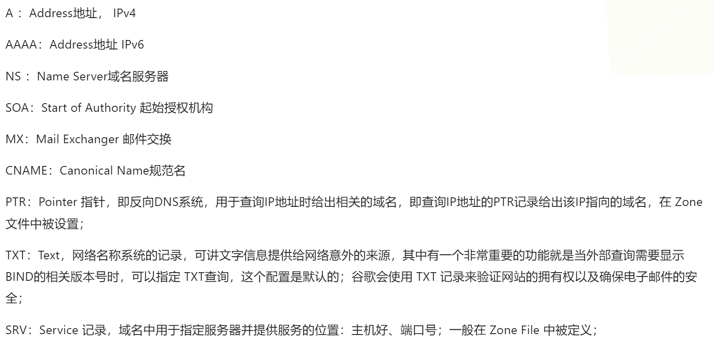
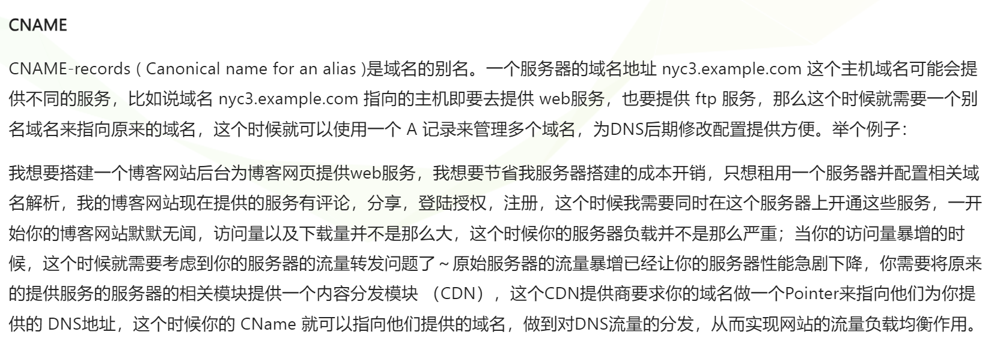
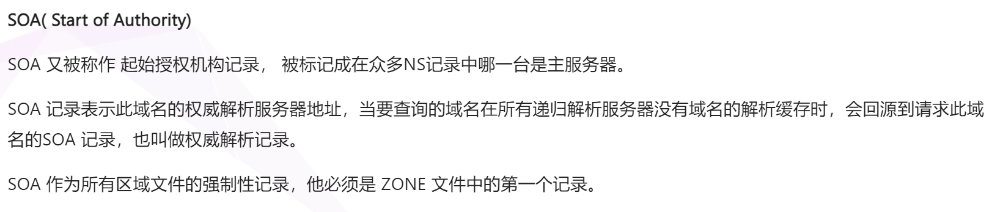
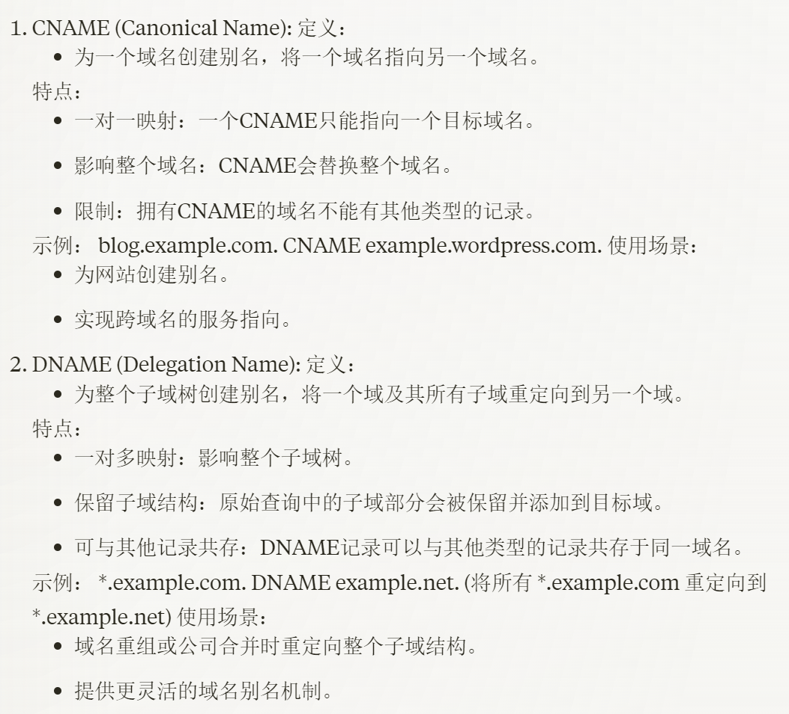
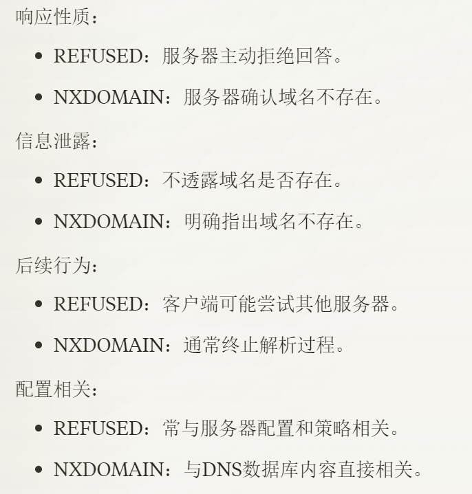
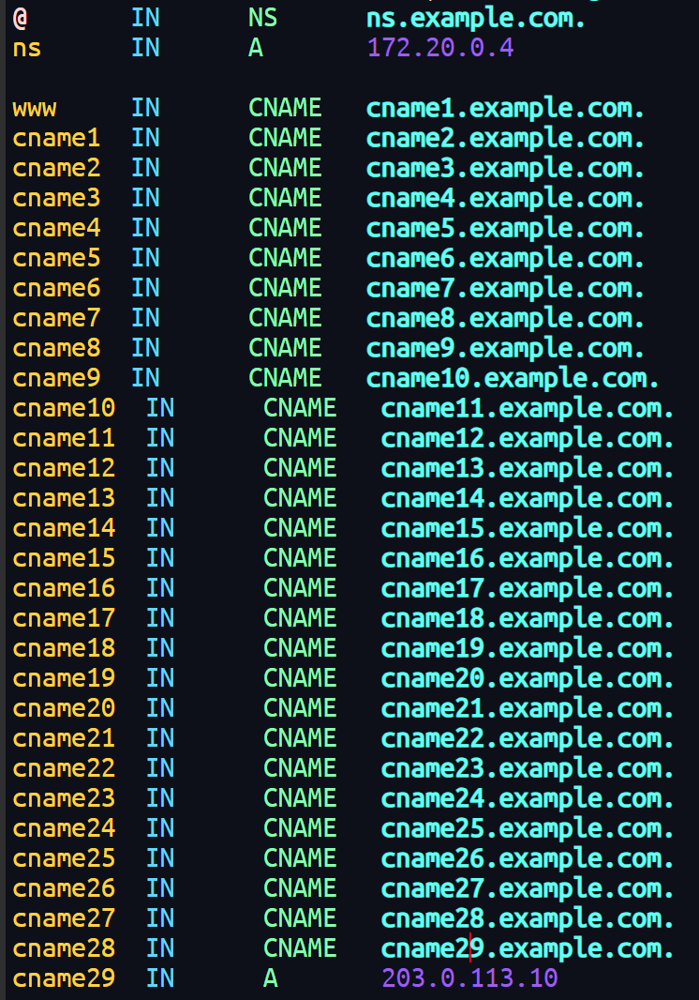
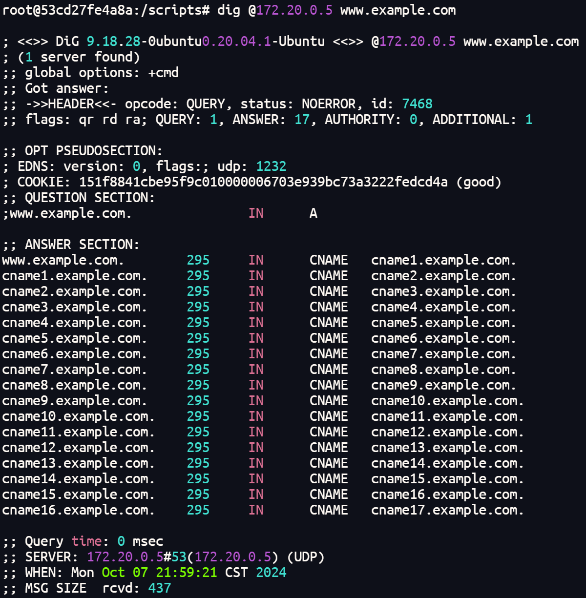
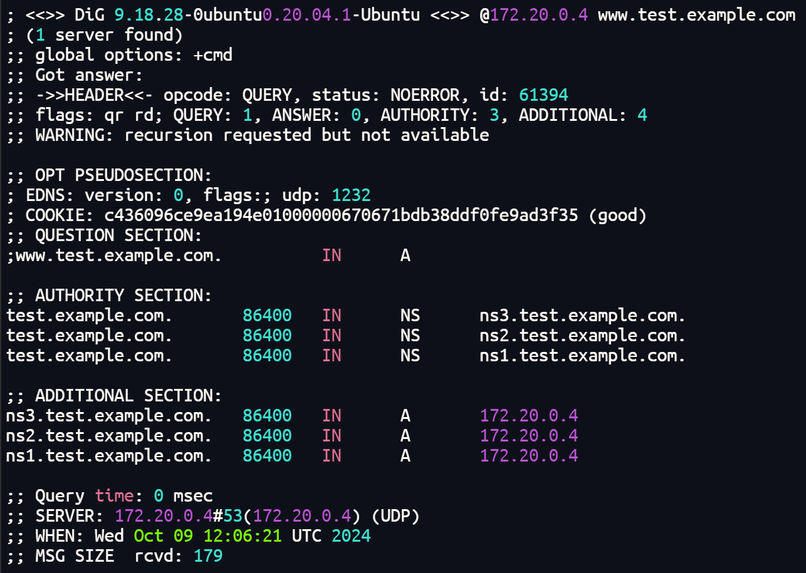
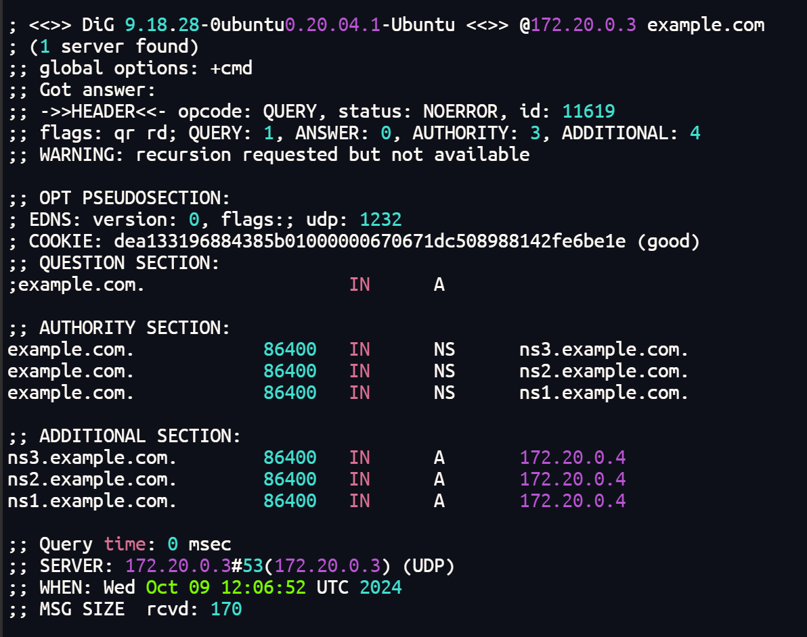
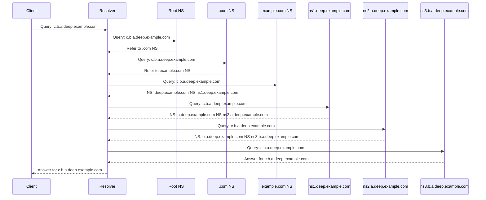

https://www.cnblogs.com/doherasyang/p/14464999.html#11-dns















@:当前域名本身





```bash
$TTL 86400
example.com.    IN      SOA     ns.example.com. admin.example.com. (
                        2023051501 ; Serial
                        3600       ; Refresh
                        1800       ; Retry
                        604800     ; Expire
                        86400      ; Minimum TTL
)

example.com.    IN      NS      ns.example.com.
ns              IN      A       172.20.0.4

; QMIN测试
deep.labels.for.qmin.test IN A 172.20.0.20

; DDLG测试
a               IN      NS      ns.a
ns.a            IN      A       172.20.0.4
a.b             IN      NS      ns.a.b
ns.a.b          IN      A       172.20.0.4
a.b.c           IN      NS      ns.a.b.c
ns.a.b.c        IN      A       172.20.0.4
a.b.c.d         IN      A       172.20.0.20
```

```bash
docker exec client dig @172.20.0.5 deep.labels.for.qmin.test.example.com
```

```bash
docker exec client dig @172.20.0.5 a.b.c.d.example.com

```



