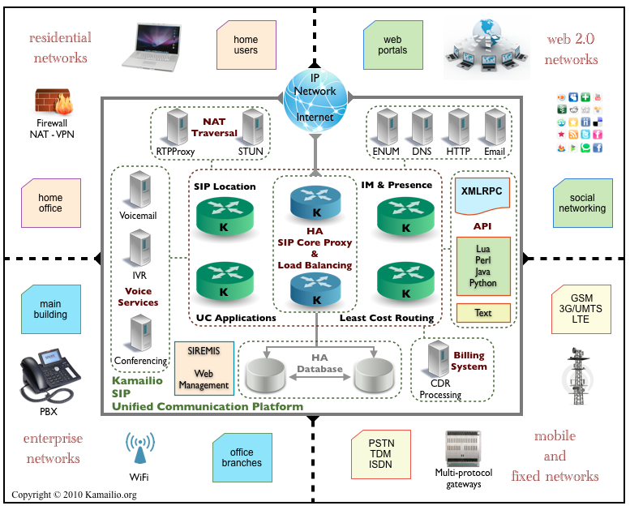
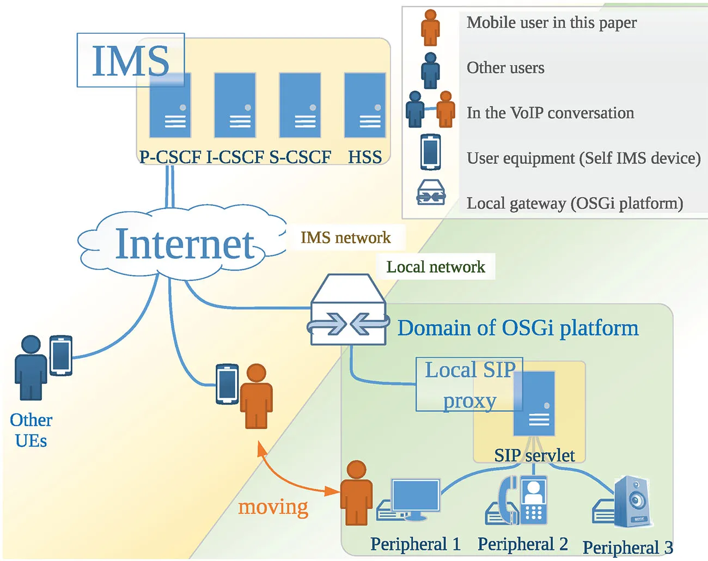
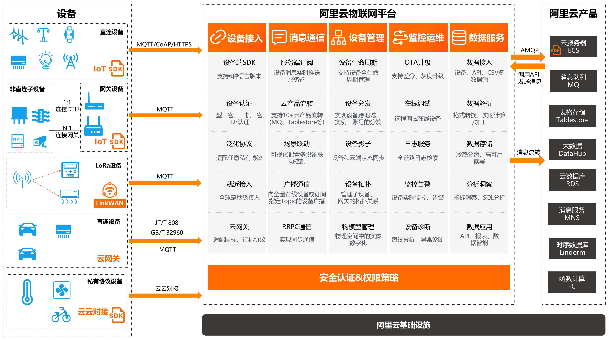
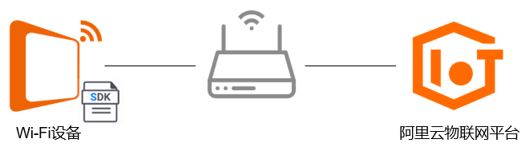
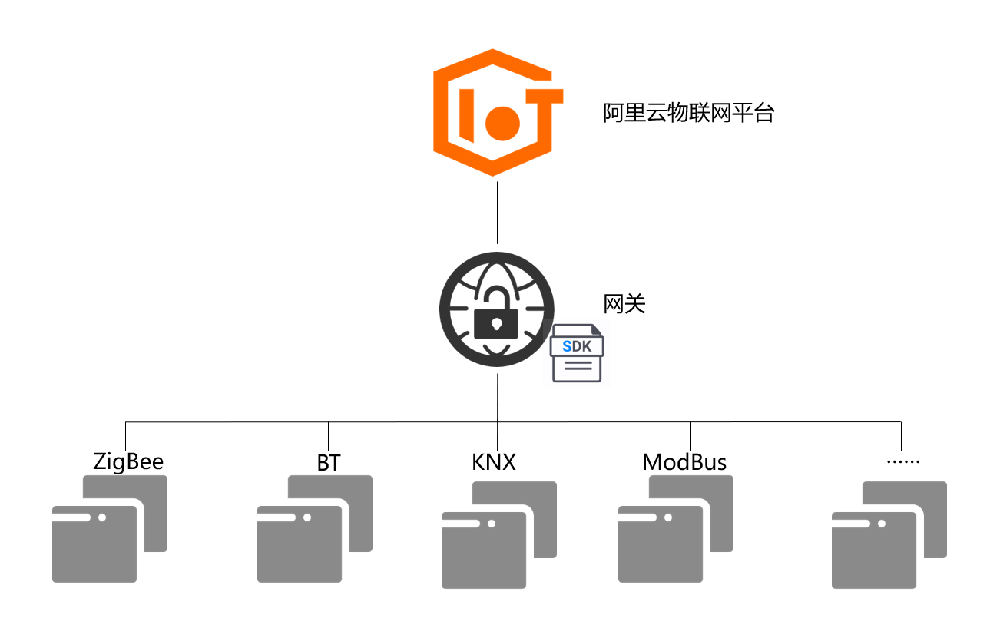
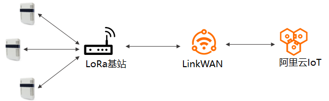
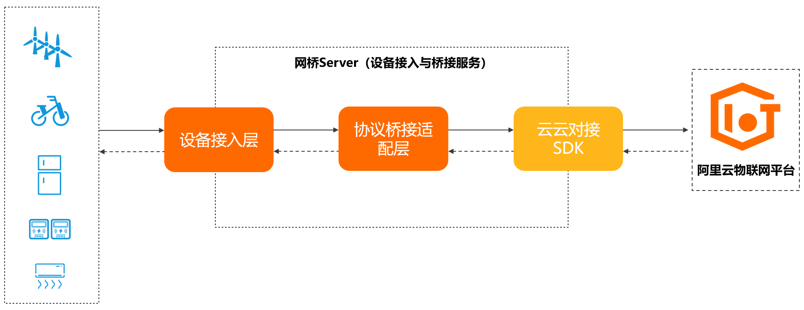

# 2024 9月第三周周报

## 一、 在服务器上部署开发环境

### 1. 安装Anaconda

版本：[Anaconda3-5.3.1-Linux-x86_64.sh](https://mirrors.tuna.tsinghua.edu.cn/anaconda/archive/Anaconda3-5.3.1-Linux-x86_64.sh)

### 2. 安装docker

使用官方安装脚本

```bash
curl -fsSL https://test.docker.com -o test-docker.sh
sudo sh test-docker.sh
```

安装依赖包

```bash
sudo apt install apt-transport-https ca-certificates curl software-properties-common
```

添加GPG密钥

```bash
curl -fsSL https://download.docker.com/linux/ubuntu/gpg | sudo gpg --dearmor -o /usr/share/keyrings/docker-archive-keyring.gpg
```

添加官方docker仓库

```bash
echo "deb [arch=amd64 signed-by=/usr/share/keyrings/docker-archive-keyring.gpg] https://download.docker.com/linux/ubuntu $(lsb_release -cs) stable" | sudo tee /etc/apt/sources.list.d/docker.list > /dev/null
```

更新包索引并安装docker组件

```bash
sudo apt update
sudo apt install docker-ce docker-ce-cli containerd.io
```

### 3. 安装Kamailio

```bash
docker run --net=host --name kamailio --rm kamailio/kamailio-ci:5.5.2-alpine
```

kamailio版本5.5.2-alpine

docker exec -it (kamailio) /bin/bash

docker save -o kamailio_image.tar kamailio/kamailio

## 二、Kamilio与IMS



### 1. Kamilio

> 参考：https://www.kamailio.org/w/2013/05/ims-kamailio/

#### （1）Kamilio功能

+ SIP服务器
  + 注册
  + 定位
  + 代理
  + SIP应用
  + 重定向
+ 灵活
  + 模块化
+ SIP路由
  + stateless and transactional stateful SIP Proxy processing
  + serial and parallel forking
  + NAT traversal support for SIP and RTP traffic
  + load balancing with many distribution algorithms and failover support
  + flexible least cost routing
  + routing failover
  + replication for High Availability (HA)
+ 运输层
  + UDP、TCP、TLS、SCTP
  + IPv4&6
  + IPv4转6，UDP转TLS
  + SCTP（流传输协议）
    + 多归属：一个IP绑定多个IP
    + 多流：一个连接中传输多个独立的数据流
    + 结合TCP的可靠性和UDP的低延迟
  + 用于WebRTC的WebSocket
+ IMS
  + 支持Diameter协议
  + CSCF（呼叫会话控制）
    + P-CSCF（代理）：UE连入IMS的第一个节点
      + 验证身份，建立IPsec安全关联
      + 压缩和解压缩SIP
      + 生成计费信息
      + 维护紧急会话路由
      + SIP信息的报头压缩/解压缩
    + I-CSCF（询问）：查询HSS以确定用户的S-CSCF
    + **S-CSCF（服务）：负责用户的会话控制和服务触发，是IMS的核心组件**
  + 计费
  + QOS
  + ISC接口：CSCF与AS之间的通信
    + 呼叫转移
    + 语音邮件

### IMS

#### 1. 概念

基于IP网提供语音和其他多媒体业务

独立于接入网技术，但是与底层传输有很多联系



#### 2. 架构

+ CSCF（见上文）

+ HSS（归属用户服务器）

  主要用户数据库，包含用户的订阅信息，是传统电信网络中HLR归属位置寄存器的改进版本

  + 用户数据管理
  + 用户状态跟踪
  + 认证支持
  + 应用服务支持
  + 移动性管理

+ 二者交互

  + S-CSCF在用户注册时获取HSS中的用户配置文件
  + I-CSCF查询HSS以确定S-CSCF
  + HSS通知S-CSCF用户数据的变更

## 三、4G网络架构

> https://blog.csdn.net/qq_44390640/article/details/135164785

## 四、物联网相关

以阿里云物联网架构为例：



+ IP设备：

  支持TCP/IP设备（WiFi），直接集成Link SDK

  

+ 非IP设备（zigbee，BT，KNX，ModBus）

  通过集成了Link SDK的网关设备接入

  

+ LoRa

  连入LoRaWAN，基于LoRa通信的设备

  例如智慧博物馆场景中，借助环境传感器设备，使用LoRa通信技术，监控藏品所在环境的温度、湿度、PM2.5等指标

  

+ 云网关

  云网关设备：物联网平台支持通过云网关接入开源的MQTT协议、JT/T 808协议和GB/T 32960协议的直连设备

+ 云云对接协议的设备：

  物联网平台支持基于MQTT、CoAP和HTTPS协议的通信，其他类型协议，如消防协议GB/T 26875.3-2011、Modbus等暂不支持。

  